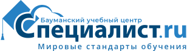
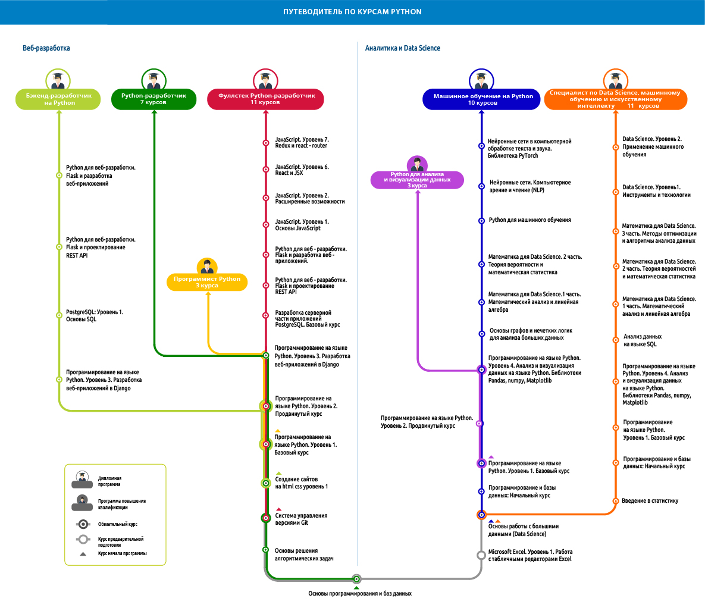

Учебный центр __«Специалист»__ - авторизованный учебный центр `Python Institute`. 

Высокая эффективность обучения подтверждена независимым некоммерческим проектом, созданным для продвижения языка программирования Python, обучения нового поколения программистов Python и поддержки профессиональной карьеры в программировании на Python и связанных технологиях.

## Программирование на языке Python. Уровень 2. Продвинутый курс

На курсе вы получите базовые навыки объектно-ориентированного программирования, познакомитесь с базовыми элементами языка Python.

Вы научитесь создавать объектно-ориентированные приложения на языке Python, сможете выполнять первичную обработку данных на языке Python, ориентироваться в стандартной библиотеке языка Python.

Также вы получите необходимую подготовку для изучения проектирования пользовательского интерфейса на базе `Qt/Python` и веб-программирования на базе `Python/Django либо Python/Flask`.

### По окончании курса вы получите престижный сертификат учебного центра «Специалист», который станет прекрасным дополнением вашего портфолио.