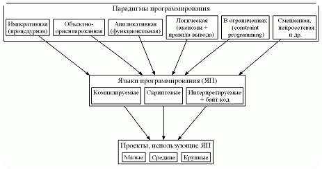
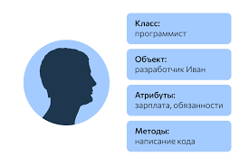
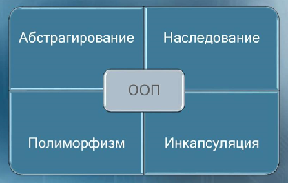
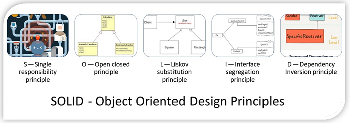
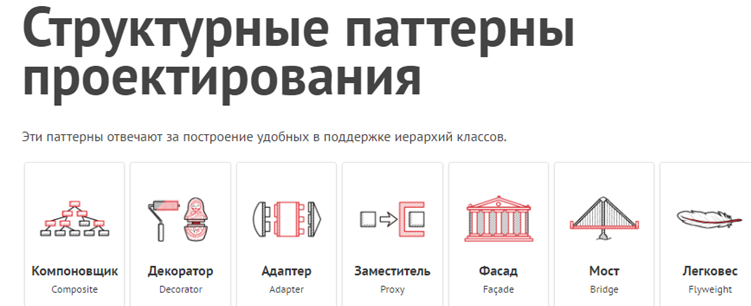

# Модуль 1. Понятие класса. Инкапсуляция  (4 ак. ч.)

### План

*	Класс и экземпляр класса.
*	Данные экземпляра, методы экземпляра и свойства экземпляра.
*	Понятие атрибута.
*	Практикум: Создание класса и его экземпляров.


## Введение

#### Парадигмы программирования



* структурное
* объектно-ориентированное
* функциональное


<details>
<summary>есть ли языки без ООП ?</summary>
* CИ (без плюсов)
* Pascal
* Fortran
* Cobol
* Ассемблер
* Rust
* VBS
</details> 

<details>
<summary>подробнее про парадигмы</summary>

Структурное программирование было открыто Дейкстрой в 1968 году. Он понял, что goto – это зло, и программы должны строиться из трёх базовых структур: последовательности, ветвления и цикла.
Объектно-ориентированное программирование было открыто в 1966 году.

Функциональное программирование открыто в 1936 году, когда Чёрч придумал лямбда-исчисление. Первый функциональный язык LISP был создан в 1958 году Джоном МакКарти.

Каждая из этих парадигм убирает возможности у программиста, а не добавляет. Они говорят нам скорее, что нам не нужно делать, чем то, что нам нужно делать.

Концепция ООП зародилась в 1960-x гг. когда. Но стоит отметить, что вплоть до начала 1990-х программисты могли свободно обходиться без ООП, пока оно не стало доминирующим направлением и внедрено в самый популярный (на тот момент) язык программирования С++. 

Так что же это такое и почему сейчас знать ООП должен каждый, уважающий себя, начинающий программист?

Для нас важно вот что: речь будет идти не просто о классах и объектах, а о том, как концепция классов и объектов реализуется в языке Python. 

Почему это важно? 

Важно потому, что сама по себе тема ООП и, более конкретно, классов и объектов, обычно достаточно сложна для понимания даже для тех, кто имеет опыт программирования. 

А в случае с языком Python проблемы, скорее всего, возникнут не только у новичков, но и у программистов, знакомых с методами ООП на примере таких языков, как C++, Java или С#.
Для тех, кто знаком с другими объектно-ориентированными языками: в Python класс сам является объектом. 

Это интригующее обстоятельство имеет весьма далеко идущие последствия.

Более того, как мы уже знаем, переменные в Python не объявляются, а вводятся в программу путем присваивания значения. 

Это же правило остается справедливым при работе с классами и объектами. 
Отсюда получается, что процедура объявления полей, стандартная для многих языков программирования, в Python просто теряет смысл. 

Аналогично, многие привычные (по языкам программирования С++, Java и С#) в ООП моменты окажутся чуждыми для языка Python. 

Короче говоря, в экзотике недостатка не будет.

</details> 


### 1. Что такое ООП?



- Программирование, построенное на классах
- Инструмент стратегического планирования
- Программная единица пакетирования логики и данных

<details>
<summary>...</summary>
ООП эффективный способ программирования, который предусматривает разложение кода на составляющие с целью минимизации избыточности и написания новых программ путем настройки существующего кода, а не его изменения на месте
</details>





### ОО ДИЗАЙН 



### ПРИНЦИПЫ ДЯДИ БОБА


### ОО-паттерны


### Банда 4-x


Обучение тому, как задействовать классы, требует времени. На практике ООП также влечет за собой значительную
работу по проектированию, чтобы получить все преимущества от многократного использования кода классов. 

С этой целью программисты начали каталогизировать распространенные структуры ООП, известные как паттерны проектирования, которые призваны помочь в решении проблем, возникающих при проектировании. 

Однако действительный код, который вы пишете с применением ООП в Python, настолько прост, что сам по себе он не будет дополнительным препятствием ОО-программирования.


### Пример-анти-пример 

вспомним курс `Python-1`
```python
печать = print
print = 123
печать (print)
```

> в нем мы переназначили встроенную функцию print, а потом еще и переопределили её. Питон это позволяет!

А теперь еще круче ... 

```python
n1 = int(10)
n2 = 20

print(type(x))
```

#### Что делает функция type?

> <class 'int'>


Что такое класс int?

#### А теперь немного магии

```python
n1 = 10
n2 = 20
print(n1 + n2)
print(n1.__add__(n2))
```


```python
class int:
    def __init__(self, value):
        self.value = value

    def __add__(self, value):
        return self.value * value


n1 = int(10)
n2 = 5

print(n1 + n2)
```

> 50 

_Что вообще происходит ?_


```python
set_a = {1, 2, 3, 4, 5}
set_b = {5, 6, 7}

print(set_a & set_b)
print(set_a.intersection(set_b))
print(set_a.__and__(set_b))
```


Об этом далее ...  

