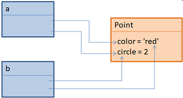
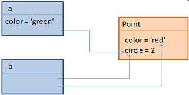
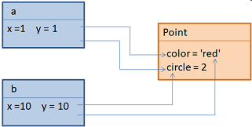

# Класс и экземпляр класса

## Трансформация от функционального мышления к ОО-мышлению


### Исходное ТЗ

Программа: чтение с клавиатуры; 
вывод в терминал.


```python
def process():
  msg = input('Введите что-нибудь: ')
  print(msg)

process()
```

### Изменения-1 в ТЗ

Добавить: чтение из файла

```python
def file_read():
    return "Зачитали файл"


def process(from_file=False):
    if from_file:
        msg = file_read()
    else:  
        msg = input('Введите что-нибудь: ')
    print(msg)

process()
process(True)
```

### Изменения-2 в ТЗ
Добавлить: отправить данные по сети.

```python
def file_read():
    return "Зачитали файл"

def from_terminal():
    return input('Введите что-нибудь: ')

def to_terminal(msg):
    print(f'Послали в терминал: {msg}')

def send_message(msg):
    print(f"Послали по сети: {msg}")

def process(from_file=False, send_to=False):
    if from_file:
        msg = file_read()
    else:
        msg = from_terminal()
        if send_to:
            send_message(msg)
        else:
            to_terminal(msg)

process()
process(True)
process(True, True)
process(False, True)
```

#### ВЫВОДЫ:

* Грязно
* Много условных выражений
* Сложно поддерживать
* Сложно понять


### Вывод – нас спасет ООП

<details>
<summary>...</summary>
Вокруг нас все объекты – человек, машина, здания, дома, компьютеры.
И объекты между собой общаются, взаимодействуют. 
В программировании общаются между собой только передачей сообщений.

В общем базовая концепция ООП состоит из двух пунктов – всё есть объект и объекты общаются между собой путем передачи сообщений.

Причем Python не 100% ООП-ориентированный язык. 
Если есть объект, то его нужно как-то классифицировать, как-то описать.

Обычно это сравнивают с чертежом, чтобы построить дом надо сделать чертеж.

Или если вспомнить зоологию, корова – копытные есть — значит класс парнокопытные, класс млекопитающих парнокопытные.

</details>

И в ООП такие же классы

```python
class ИмяКласса:
    pass

type(ИмяКласса)
```

Мы видим результат `<class 'type'>`. 

На самом деле класс – это объект для описания других объектов

В блоке `ИмяКласса` мы и будем описывать атрибутику, поведение, методы. 

Вообще всё, что он из себя представляет. 

Пока он пустой, но мы уже можем создавать объекты этого класс. 
Конвеницально принято называть имена классов с большой буквы.
Обращение также как как функции, но не забываем про большую букву


``` python
объект = ИмяКласса()
print (type(объект))
```

Запустим 

> `<class '__main__.ИмяКласса'>`

Как проверить, является ли наш объект экземплярам конкретного класса
``` python
isinstance(объект, ИмяКласса)
```
это функция – предикат, возвращает булев тип. 

Ну и соответственно возвращает 

``` python
print (isinstance(объект, list))
```

### Пример

Предположим, мы хотим определить класс для хранения координат точек на плоскости. 

Для начала я его запишу без какого-либо содержимого, только имя класса Point и все:

```python
class Point:
    pass
```

Здесь оператор pass указывает, что мы в классе ничего не определяем. 

Также обратите внимание, что  в соответствии со стандартом PEP8 имя класса принято записывать с заглавной буквы. 

И, конечно же, называть так, чтобы оно отражало суть этого класса. В дальнейшем мы будем придерживаться этого правила.

Итак, у нас получилось простейшее определение класса с именем Point. Но в таком виде он не особо полезен. 

Пропишем в нем два атрибута: color – цвет точек; circle – радиус точек:

```python
class Point:
    color = 'red'
    circle = 2
```

Обратите внимание, переменные внутри класса обычно называются атрибутами класса или его свойствами. 

Теперь в нашем классе есть два атрибута color и circle. Но, как правильно воспринимать эту конструкцию? 

Фактически, сам класс образует пространство имен, в данном случае с именем Point, в котором находятся две переменные color и circle. И мы можем обращаться к ним, используя синтаксис для пространства имен, например:

```
Point.color = 'black'
```

или для считывания значения:
```
Point.circle
```
(В консольном режиме увидим значение 2). А чтобы увидеть все атрибуты класса можно обратиться к специальной коллекции `__dict__`:

```
Point.__dict__
```

Здесь отображается множество служебных встроенных атрибутов и среди них есть два наших: `color и circle`.

Теперь сделаем следующий шаг и создадим экземпляры этого класса. В нашем случае для создания объекта класса Point достаточно после его имени прописать круглые скобки:

```
a = Point()
```
Смотрите, справа на панели в Python Console у нас появилась переменная a, через которую доступны два атрибута класса: `color и circle`.

Давайте создадим еще один объект этого класса:

```
b = Point()
```
Появилась переменная b, которая ссылается на новый объект (он расположен по другому адресу) и в этом объекте мы также видим два атрибута класса Point.

По аналогии можно создавать произвольное количество экземпляров класса.

С помощью функции type мы можем посмотреть тип данных для переменных a или b:
```
type(a)
```
Видим, что это класс Point. Эту принадлежность можно проверить, например, так:
```
type(a) == Point
```
или так:
```
isinstance(a, Point)
```


Во-первых, объекты `a и b` образуют свое пространство имен – пространство имен экземпляров класса и, во-вторых, не содержат никаких собственных атрибутов. 

Свойства `color и circle` принадлежат непосредственно классу `Point` и находятся в нем, а объекты `a и b` лишь имеют ссылки на эти атрибуты класса. 

Поэтому я не случайно называю их именно атрибутами класса, подчеркивая этот факт. То есть, атрибуты класса – общие для всех его экземпляров. 

И мы можем легко в этом убедиться.

Давайте изменим значение свойства `circle на 1`:
```
Point.circle = 1
```
И в обоих объектах это свойство стало равно 1. Мало того, если посмотреть коллекцию `__dict__ `у объектов:

```
a.__dict__
```
то она будет пустой, так как в наших экземплярах отсутствуют какие-либо атрибуты. Но, тем не менее, мы можем через них обращаться к атрибутам класса:
```
a.color
b.circle
```
Но, если мы выполним присваивание, например:
```
a.color = 'green'
```
То, смотрите, в объекте a свойство color стало 'green', а в b – прежнее. Почему? Дело в том, что мы здесь через переменную a обращаемся к пространству имен уже экземпляра класса и оператор присваивания в Python создает новую переменную, если она отсутствует в текущей локальной области видимости, то есть, создается атрибут color уже непосредственно в объекте a:





То есть, мы с вами создали локальное свойство в объекте `a`. 

Этот момент нужно очень хорошо знать и понимать. На этом принципе в Python построено формирование атрибутов классов и локальных атрибутов их экземпляров.

Добавление и удаление атрибутов класса
Кстати, по аналогии, мы можем создавать новые атрибуты и в классе, например, так:
```
Point.type_pt = 'disc'
```
Или то же самое можно сделать с помощью специальной функции:
```
setattr(Point, 'prop', 1)
```
Она создает новый атрибут в указанном пространстве имен (в данном случае в классе Point) с заданным значением. Если эту функцию применить к уже существующему атрибуту:
```
setattr(Point, 'type_pt', 'square')
```
то оно будет изменено на новое значение.

Если же мы хотим прочитать какое-либо значение атрибута, то достаточно обратиться к нему. В консольном режиме это выглядит так:
```
Point.circle
```
Но, при обращении к несуществующему атрибуту класса, например:
```
Point.a
```
возникнет ошибка. Этого можно избежать, если воспользоваться специальной встроенной функцией:
```
getattr(Point, 'a', False)
```
Здесь третий аргумент – возвращаемое значение, если атрибут не будет найден. Эту же функцию можно вызвать и с двумя аргументами:
```
getattr(Point, 'a')
```
Но тогда также будет сгенерирована ошибка при отсутствии указанного атрибута. Иначе:
```
getattr(Point, 'color')
```
она возвратит его значение. 

То есть, эта функция дает нам больше гибкости при обращении к атрибутам класса. 
Хотя на практике ей пользуются только в том случае, если есть опасность обращения к несуществующим атрибутам. 
Обычно, все же, применяют обычный синтаксис:

```
Point.color
```
Наконец, мы можем удалять любые атрибуты из класса. Сделать это можно, по крайней мере, двумя способами. Первый – это воспользоваться оператором `del`:

```
del Point.prop
```
Если повторить эту команду и попытаться удалить несуществующий атрибут, возникнет ошибка. Поэтому перед удалением рекомендуется проверять существование удаляемого свойства. Делается это с помощью функции `hasattr`:
```
hasattr(Point, 'prop')
```
Она возвращает True, если атрибут найден и `False` – в противном случае.

Также удалить атрибут можно с помощью функции:
```
delattr(Point, 'type_pt')
```
Она работает аналогично оператору `del`.

И, обратите внимание, удаление атрибутов выполняется только в текущем пространстве имен. Например, если попытаться удалить свойство color из объекта b:
```
del b.color
```

то получим ошибку, т.к. в объекте b не своих локальных свойств и удалять здесь в общем то нечего. А вот в объекте a есть свое свойство color, которое мы с вами добавляли:
```
a.__dict__
```

и его можно удалить:
```
del a.color
```

Смотрите, после удаления локального свойства color в объекте a становится доступным атрибут `color` класса `Point` с другим значение `black`.

И это логично, т.к. если свойство не обнаруживается в локальной области, то поиск продолжается в следующей (внешней) области видимости. 

А это (для объекта a) класс `Point`. 

Вот этот момент также следует хорошо понимать при работе с локальными свойствами объектов и атрибутами класса.

### Атрибуты экземпляров классов

Теперь, когда мы знаем, как создаются атрибуты, вернемся к нашей задаче формирования объектов точек на плоскости. Мы полагаем, что атрибуты `color` и `circle` класса `Point` – это общие данные для всех объектов этого класса. А вот координаты точек должны принадлежать его экземплярам. 

Поэтому для объектов a и b мы определим локальные свойства x и y:
```
a.x = 1
a.y = 2
b.x = 10
b.y = 20
```

То есть, свойства `x`, `y` будут существовать непосредственно в объектах, но не в самом классе `Point`:




### Что такое класс?

- Пакет функций
- Главный инструмент ООП
- Оснащение, отражающее реальные объекты в программе
- Фабрика производства экземпляров

<details>
<summary>...</summary>
классы предназначены для создания и управления новыми объектами и поддерживают наследование — механизм настройки и многократного применения кода
</details>


### 3. Принципы (аспекты) ООП

- Наследование
- Композиция

### Механизм ООП в Python - 2 порции магии

- Первый аргумент self
- Поиск в иерархии наследования

## Резюме

- Всё остальное в ООП сводится к функциям
- Не являясь радикально новым, ООП добавляет дополнительный уровень структуры, которая поддерживает
  более эффективное программирование, чем обычные процедурные модели.
- Наряду с рассмотренными ранее функциональными инструментами ООП олицетворяет собой значительный шаг в сторону абстрагирования от компьютерного оборудования, который помогает нам строить более сложно устроенные программы.

## Продолжение введения

- ООП в Python гораздо проще для понимания и использования, чем в других языках, таких как C++ или Java.
- Будучи динамически типизированным языком написания сценариев, Python устраняет большую часть синтаксического беспорядка и сложности, которые затуманивают ООП в других инструментах.
- На самом деле большинство истории ООП в Python сводится до следующего выражения:

```python
объект.атрибут
```

**Классы**

Служат фабриками экземпляров. Атрибуты классов обеспечивают поведение (данные и функции), которое наследуется всеми экземплярами, сгенерированными из них (например, функция для расчета заработной платы сотрудника на основе оклада и отработанных часов).

**Экземпляры**

Представляют конкретные элементы в предметной области программы.
Атрибуты экземпляров хранят данные, которые варьируются для каждого отдельного объекта (скажем, номер карточки социального страхования сотрудника).

```
С точки зрения деревьев поиска экземпляр наследует атрибуты от своего класса, а класс наследует атрибуты от всех классов выше в дереве.
```

- Хотя формально классы и экземпляры, помещаемые в деревья наследования, являются разными типами объектов в модели Python, они практически идентичны;

- Главная цель каждого типа заключается в том, чтобы служить еще одним видом пространства имен — пакета переменных и места, куда мы можем присоединять атрибуты.

- Таким образом, если классы и экземпляры выглядят подобными модулям, то так и должно быть;

- Но, тем не менее, объекты в деревьях классов также имеют автоматически просматриваемые ссылки на другие объекты пространств имен и классы соответствуют операторам, а не целым файлам.

## Резюме

- Основное отличие между классами и экземплярами состоит в том, что классы представляют собой своего рода фабрики ддя генерирования экземпляров.

- Второе отличие между классами и модулями — мы можем иметь только один экземпляр отдельного модуля в памяти (именно потому модуль приходится перезагружать, чтобы получить его новый код), но для классов допускается создавать столько экземпляров, сколько нужно.


### Пример 1. Лампочки

Создадим класс Lamp как светильник

```python
class Lamp:
    pass

lamp1 = Lamp()
lamp2 = Lamp()

print(isinstance(lamp1, Lamp))
print(isinstance(lamp2, Lamp))
```

Результат:

> True

Лампочки уже есть, но они ничего не могут делать. Зачем они тогда нужны.

Вспомним концепцию ООП – все лампочки общаются сообщениями. 

Или другой вариант – у объектов есть поведение.

Человек может ходить, автомобиль ехать. Лампочка включаться-выключаться. 

Человек общается с человеком передачей сообщений. Для этой цели в ООП используются методы. 

По сути класс – это набор методов.

А методы – ничто иное как обычные функции, просто которые описаны в классе. Все-что мы знаем о функциях здесь легко применить.

Добавим функции включения-выключение лампочки


```python
class Lamp:
    def switch_on():
        print('Лампочку включили')

    def switch_off():
        print('Лампочку выключили')

```

и пошлем сообщение “Лампочка включись”


```
lamp1.switch_on()
lamp1.switch_off()
```

но мы видим ошибку

> TypeError: Lamp.switch_on() takes 0 positional arguments but 1 was given


Ошибка типа: ```Lamp.switch_on()``` принимает 0 позиционных аргументов, но был задан 1.

Где это параметр, я ничего не передал. 

Используем принцип наименьшего удивления

В чем причина? У нас два объекта, а метод у них один.

А интерпретатор внутри класса не понимает у какого объекта нужно дернуть метод switch-on/off.

___

### Конструктор класса

Проблема в области видимости. 

В глобальной мы всё видим, а класс внутри себя не понимает кто в него стучится.

Поэтому Пайтон всегда неявно сюда первым параметром передает этот объект 
```lamp1.switch_on(lamp1)```

а метод switch должен принять его

```python
def switch_on(себяшка):
    print('Лампочку включили')
```

т.е. себяшка – обычный аргумент функции. 

Но по конвенции это дело обычно называют self.

Возникает вопрос – зачем этот self, если он передается во все методы, зачем его передавать, зачем его указывать. 

Но увы, конвенция, и во всех методах мы обязаны его указывать. Но с другой стороны.

В php и JS таким словом является ```this```. 

Но причем там оно явно не пишется

Во внешнем мире он lamp или Александр Петрович, а в духовном мире (волшебно-магическом) отец Георгий или self.


Итак перед вами – минимальная концепция ООП, ОО-парадигмы. 

Открой, закрой, включи. 

Обычные функции. Общий принцип 

```python
    def имя_метода (self):
        pass

объект = Lamp()
объект.имя_метода()
```


Технически на этом можно остановиться, но у нас есть засада. 

Лампочку можно выключать бесконечное множество раз. 

А каким образом выключать то, что еще не включили.


Значит нам нужен флаг или логическое состоянии. 

Т.е. кроме поведения, к примеру у человека – бегать, прыгать, есть, говорить, учится, у человека есть состояния – возраст,  имя, 
Соответственно у объектов тоже есть состоянии. 

И они называются атрибутами.
Атрибут вроде как обычная переменная.

Добавим атрибут состояния в класс  Lamp

```python
class Lamp:
    def switch_on(self):
        self.state = True
        print('Лампочку включили')

    def switch_off(self):
        if self.state == True:
            print('Лампочку выключили')
            self.state == False


lamp1.switch_on()
lamp1.switch_off()
```

работает!? Но! 

```python
lamp1.switch_on()
lamp1.switch_off()

lamp1.switch_off()
```
или просто выключить без включения

```python
lamp1.switch_off()
```

> AttributeError: 'Lamp' object has no attribute 'state'

Нет атрибута state у лампы. 

Мы можем конечно, что то здесь проверит в switch, поставить if и так далее


Но на самом деле, правильный путь – где-то это состояние проинициализировать.

Инициализацией кода в ООП называется конструктор. 
___

### Конструктор

Конструктор – специальные метод, который (1) запускается автоматически, (2) запускается при создании объекта

Служебное имя у конструктора `__init__`

Иногда можно встретить вместо конструктор слова инициализатор, а даже инстанс (в java).

Т.о. создается объект, вызывается его конструктор, записывается в память (как правило это обычная переменная). 

Это обычная переменная, все объекты в пайтоне – ссылочного типа. 

Здравствуй, волшебство. Привет, дандер-методы.

Эти методы четко определены с помощью двойного подчеркивания до и после имени метода
Как правило все атрибуты создаются, инициализируются в конструкторе

```python
    def __init__(self):
        self.state = False
```

т.е по дефолту наша лампочка еще не горит.
Теперь мы можем по-человечески отследить состояние лампочки

```python
    def switch_on(self):
        if not self.state:
            self.state = True
            print('Лампочку включили')

    def switch_off(self):
        if self.state:
            print('Лампочку выключили')
            self.state = False
```

Поэкспериментируем в консоли. 

Логика не нарушена, дизайн хороший. Багов и дыр нету?

Краткий итог – self, init

Появление переменных где-то в середине кода – плохой стиль, откуда, чего, куда, зачем.

Поэтому и метод init помогает решить эту задачу. 

Однако, вдруг нам захочется определить еще какой-нибудь атрибут у лампочки, например этажность

```python
self.floor = 1
```

Но так явно не совсем удобно, допустим мне бы хотелось явно при создании лампочки, указать этаж, на котором её разместить

```python
lamp1 = Lamp(1)
lamp2 = Lamp(2)
```

поэтому здесь можно определить стандартный параметр 

```python
  def __init__(self, floor=0):
        self.state = False
        self.floor = floor
```


Таким образом, мы можем напрямую обращаться к его свойствам, атрибутам.
```python
lamp1.state
```

> False
lamp2.floor
> 2


Однако, если я захочу вывести
```python
print (lamp2)
```

результат будет ледующий

> <__main__.Lamp object at 0x0000025210B5D250>


Но это не очень информативно, но такую возможность упускать не нужно.

```python
print ([1,2,3])
```

Но нам нужно, чтобы при обращении к лампе команда print вывела состояние лампочки, на каком она этаже, сколько её ресурс и т.п.

И первый раз мы подходим к понятию переопределение методов.

У пайтона есть много служебных методов, и нашем случае мы обращались к методу repr.
От слова representation

```python
    def __repr__(self):
        return f'Я лампочка на {self.floor} этаже'
```

на самом деле здесь 2 таких метода, второй метод ```__str__```
и он вызывается только в принте, repr во всех случаях.

```python
def __str__(self):
        return f'Я лампочка на {self.floor} этаже'
s = lamp2
print (s)
```

волшебный дандер метод ```__repr__``` более универсален

Т.о. класс набор методов, которые описывают поведение будущего объекта (экземпляра будущего класса). 

Также у объекта могут быть атрибуты, состояния. 

В некоторых книжках очень много акцентов делается на атрибуты. 

Но атрибуты вторичны. 

Концепция ООП крутится вокруг методов.  

Класс – несколько функций во одном флаконе, коробка в которой хранятся методы и переменные.

Можно легко накосячить и уйти в некуда.

___

