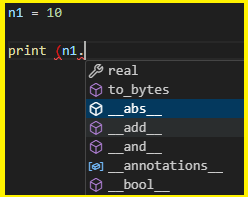

# Класс и экземпляр класса

### Пример 1. Объекты. 


```python
n1 = int(10)
n2 = 20

print(type(x))

```

#### Что делает функция type?

> <class 'int'>




Что такое класс int?

#### А теперь немного магии

```python
n1 = 10
n2 = 20
print(n1 + n2)
print(n1.__add__(n2))
```


```python
class int:
    def __init__(self, value):
        self.value = value

    def __add__(self, value):
        return self.value * value


n1 = int(10)
n2 = 5

print(n1 + n2)
```

> 50 

_Что вообще происходит ?_

### Пример 2. Лампочки

Создадим класс Lamp как светильник

```python
class Lamp:
    pass

lamp1 = Lamp()
lamp2 = Lamp()

print(isinstance(lamp1, Lamp))
print(isinstance(lamp2, Lamp))
```

Результат:

> True

Лампочки уже есть, но они ничего не могут делать. Зачем они тогда нужны.

Вспомним концепцию ООП – все лампочки общаются сообщениями. 

Или другой вариант – у объектов есть поведение.

Человек может ходить, автомобиль ехать. Лампочка включаться-выключаться. 

Человек общается с человеком передачей сообщений. Для этой цели в ООП используются методы. 

По сути класс – это набор методов.

А методы – ничто иное как обычные функции, просто которые описаны в классе. Все-что мы знаем о функциях здесь легко применить.

Добавим функции включения-выключение лампочки


```python
class Lamp:
    def switch_on():
        print('Лампочку включили')

    def switch_off():
        print('Лампочку выключили')

```

и пошлем сообщение “Лампочка включись”


```
lamp1.switch_on()
lamp1.switch_off()
```

но мы видим ошибку

> TypeError: Lamp.switch_on() takes 0 positional arguments but 1 was given


Ошибка типа: ```Lamp.switch_on()``` принимает 0 позиционных аргументов, но был задан 1.

Где это параметр, я ничего не передал. 

Используем принцип наименьшего удивления

В чем причина? У нас два объекта, а метод у них один.

А интерпретатор внутри класса не понимает у какого объекта нужно дернуть метод switch-on/off.

___

### Конструктор класса

Проблема в области видимости. 

В глобальной мы всё видим, а класс внутри себя не понимает кто в него стучится.

Поэтому Пайтон всегда неявно сюда первым параметром передает этот объект 
```lamp1.switch_on(lamp1)```

а метод switch должен принять его

```python
def switch_on(себяшка):
    print('Лампочку включили')
```

т.е. себяшка – обычный аргумент функции. 

Но по конвенции это дело обычно называют self.

Возникает вопрос – зачем этот self, если он передается во все методы, зачем его передавать, зачем его указывать. 

Но увы, конвенция, и во всех методах мы обязаны его указывать. Но с другой стороны.

В php и JS таким словом является ```this```. 

Но причем там оно явно не пишется

Во внешнем мире он lamp или Александр Петрович, а в духовном мире (волшебно-магическом) отец Георгий или self.


Итак перед вами – минимальная концепция ООП, ОО-парадигмы. 

Открой, закрой, включи. 

Обычные функции. Общий принцип 

```python
    def имя_метода (self):
        pass

объект = Lamp()
объект.имя_метода()
```


Технически на этом можно остановиться, но у нас есть засада. 

Лампочку можно выключать бесконечное множество раз. 

А каким образом выключать то, что еще не включили.


Значит нам нужен флаг или логическое состоянии. 

Т.е. кроме поведения, к примеру у человека – бегать, прыгать, есть, говорить, учится, у человека есть состояния – возраст,  имя, 
Соответственно у объектов тоже есть состоянии. 

И они называются атрибутами.
Атрибут вроде как обычная переменная.

Добавим атрибут состояния в класс  Lamp

```python
class Lamp:
    def switch_on(self):
        self.state = True
        print('Лампочку включили')

    def switch_off(self):
        if self.state == True:
            print('Лампочку выключили')
            self.state == False


lamp1.switch_on()
lamp1.switch_off()
```

работает!? Но! 

```python
lamp1.switch_on()
lamp1.switch_off()

lamp1.switch_off()
```
или просто выключить без включения

```python
lamp1.switch_off()
```

> AttributeError: 'Lamp' object has no attribute 'state'

Нет атрибута state у лампы. 

Мы можем конечно, что то здесь проверит в switch, поставить if и так далее


Но на самом деле, правильный путь – где-то это состояние проинициализировать.

Инициализацией кода в ООП называется конструктор. 
___

### Конструктор

Конструктор – специальные метод, который (1) запускается автоматически, (2) запускается при создании объекта

Служебное имя у конструктора ````__init__````

Иногда можно встретить вместо конструктор слова инициализатор, а даже инстанс (в java).

Т.о. создается объект, вызывается его конструктор, записывается в память (как правило это обычная переменная). 

Это обычная переменная, все объекты в пайтоне – ссылочного типа. 

Здравствуй, волшебство. Привет, дандер-методы.

Эти методы четко определены с помощью двойного подчеркивания до и после имени метода
Как правило все атрибуты создаются, инициализируются в конструкторе

```python
    def __init__(self):
        self.state = False
```

т.е по дефолту наша лампочка еще не горит.
Теперь мы можем по-человечески отследить состояние лампочки

```python
    def switch_on(self):
        if not self.state:
            self.state = True
            print('Лампочку включили')

    def switch_off(self):
        if self.state:
            print('Лампочку выключили')
            self.state = False
```

Поэкспериментируем в консоли. 

Логика не нарушена, дизайн хороший. Багов и дыр нету?

Краткий итог – self, init

Появление переменных где-то в середине кода – плохой стиль, откуда, чего, куда, зачем.

Поэтому и метод init помогает решить эту задачу. 

Однако, вдруг нам захочется определить еще какой-нибудь атрибут у лампочки, например этажность

```python
self.floor = 1
```

Но так явно не совсем удобно, допустим мне бы хотелось явно при создании лампочки, указать этаж, на котором её разместить

```python
lamp1 = Lamp(1)
lamp2 = Lamp(2)
```

поэтому здесь можно определить стандартный параметр 

```python
  def __init__(self, floor=0):
        self.state = False
        self.floor = floor
```


Таким образом, мы можем напрямую обращаться к его свойствам, атрибутам.
```python
lamp1.state
```

> False
lamp2.floor
> 2


Однако, если я захочу вывести
```python
print (lamp2)
```

результат будет ледующий

> <__main__.Lamp object at 0x0000025210B5D250>


Но это не очень информативно, но такую возможность упускать не нужно.

```python
print ([1,2,3])
```

Но нам нужно, чтобы при обращении к лампе команда print вывела состояние лампочки, на каком она этаже, сколько её ресурс и т.п.

И первый раз мы подходим к понятию переопределение методов.

У пайтона есть много служебных методов, и нашем случае мы обращались к методу repr.
От слова representation

```python
    def __repr__(self):
        return f'Я лампочка на {self.floor} этаже'
```

на самом деле здесь 2 таких метода, второй метод ```__str__```
и он вызывается только в принте, repr во всех случаях.

```python
def __str__(self):
        return f'Я лампочка на {self.floor} этаже'
s = lamp2
print (s)
```

волшебный дандер метод ```__repr__``` более универсален

Т.о. класс набор методов, которые описывают поведение будущего объекта (экземпляра будущего класса). 

Также у объекта могут быть атрибуты, состояния. 

В некоторых книжках очень много акцентов делается на атрибуты. 

Но атрибуты вторичны. 

Концепция ООП крутится вокруг методов.  

Класс – несколько функций во одном флаконе, коробка в которой хранятся методы и переменные.

Можно легко накосячить и уйти в некуда.

___

