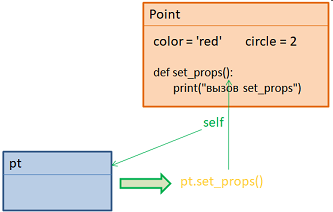

## Методы классов

> в модели ООП языка Python имеются два вида объектов:

* объекты классов (фабрика)
* объекты экземпляров

Как известно, класс может содержать свойства (данные) и методы (функции).

Благодаря методам внутри класса можно реализовывать самые разные алгоритмы, то есть методы – это действия. Именно поэтому, в названиях методов используют глаголы, например:

> set_value, get_param, start, stop, и т.п.

В то время как именами свойств (данных) выступают существительные:

> color, size, x, y, и т.п.

Рекомендуется придерживаться этого простого правила.

Давайте, для примера объявим метод set_coords в классе Point, который будет просто выводить в консоль сообщение «вызов метода set_coords»:
```python
class Point:
    color = 'red'
    circle = 2
 
    def set_coords(self):
        print("вызов метода set_coords")
```

Здесь сразу бросается в глаза вот этот параметр `self`, который автоматически прописывает интегрированная среда. 

Зачем он здесь, если мы пока ничего не собираемся передавать этому методу? 

Давайте его уберем! Пока никаких проблем не возникло. Мало того, мы можем его вызвать из класса `Point`:

> Point.set_coords()

и все будет работать без ошибок. 

Здесь мы видим, как вызываются методы класса. Все довольно очевидно. 

Записываем имя класса `(Point)`, и через точку указываем имя метода. 

В конце обязательно прописываем круглые скобки, так как это оператор вызова функций. 

И, так как метод – это функция класса, то для вызова метода используется тот же оператор, что и для вызова функций.

В результате, мы получили класс, в котором два свойства и один метод. Далее, создадим экземпляр этого класса:

> pt = Point()

И, как мы с вами говорили, через объект `pt` можно обращаться ко всем атрибутам класса `Point`, в том числе и к методу `set_coords`:

> pt.set_coords

Этот атрибут ссылается на объект-функцию, которую мы определили в классе `Point`. Попробуем ее вызвать:

> pt.set_coords()


Видим ошибку, что в метод `set_coords` при вызове передается один аргумент, а он у нас определен без параметров. 

Дело в том, что когда мы вызываем методы класса через его объекты, то интерпретатор `Python` автоматически добавляет первым аргументом ссылку на объект, из которого этот метод вызывается.



Поэтому, если мы хотим внутри класса определить метод, который можно было бы вызывать из его экземпляров, то дополнительно прописывается первый параметр, обычно, с именем `self`:

```python
class Point:
    color = 'red'
    circle = 2
 
    def set_coords(self):
        print("вызов метода set_coords " + str(self))
```

Еще раз, параметр `self` будет ссылаться на экземпляр класса, из которого вызывается метод. 

Зачем это надо? 

После этого дополнения мы уже не сможем вызвать данный метод через класс без указания первого аргумента:

```python
Point.set_coords()
```

но можем через его объекты:

```python
pt.set_coords()
```

То есть, когда метод вызывается через класс, то Python автоматически не подставляет никаких аргументов.

А когда вызов идет через экземпляры класса, то первый аргумент – это всегда ссылка на экземпляр.

Данный момент нужно знать и помнить.

Но мы все же можем вызвать метод `set_coords` и через класс, если явно передадим ссылку на объект `pt`, следующим образом:

```python
Point.set_coords(pt)
```

Именно это на автомате делает `Python`, когда вызов осуществляется через объекты классов.

Так зачем понадобилось такое поведение? 

Дело в том, что метод класса – это тоже его атрибут и когда создаются экземпляры класса, то метод становится общим для всех объектов и не копируется в них. 

Фактически, только благодаря параметру `self` мы «знаем» какой объект вызвал данный метод и можем организовать с ним обратную связь.

Например, пусть метод `set_coords` задает координаты точек для текущего объекта. 

Тогда, мы пропишем в нем два дополнительных параметра и через `self` в самом экземпляре класса создадим (либо переопределим) два свойства:

```python
class Point:
    color = 'red'
    circle = 2
 
    def set_coords(self, x, y):
        self.x = x
        self.y = y
```
В результате, при вызове метода:

```python
pt.set_coords(1, 2)
print(pt.__dict__)
```

в объекте pt будут созданы два свойства `x, y` со значениями `1 и 2`. 

Вот для чего нужен этот параметр `self`. 
Если в программе создать еще один объект:

```python
pt2 = Point()
```
и через него вызвать тот же самый метод:

```python
pt2.set_coords(10, 20)
print(pt2.__dict__)
```

То увидим, что свойства `x, y` со значениями `10` и `20` были созданы только в нем (в его пространстве имен) и никак не связаны с координатами другого объекта pt или классом `Point`. 

То есть, через `self` мы работаем с конкретным объектом, из которого был вызван данный метод.

Конечно, в классах мы можем прописывать произвольное количество методов. 

Например, определим еще один, который будет возвращать координаты точки в виде кортежа значений:

```python
class Point:
    color = 'red'
    circle = 2
 
    def set_coords(self, x, y):
        self.x = x
        self.y = y
 
    def get_coords(self):
        return (self.x, self.y)
```
И ниже в программе можем вызвать его:
```python
print(pt.get_coords())

```
Интересно, что так как имя метода – это атрибут класса, то мы можем обратиться к нему через знакомую нам уже функцию:

```python
res = getattr(pt, 'get_coords')
print(res)
```
Видим, что это ссылка на объект-функцию. 

А раз так, то ничто нам не мешает ее здесь вызывать:
```python
print(res())
```
Конечно, так делают очень редко. Обычно используют синтаксис через точку. 

Я привел это, чтобы еще раз подчеркнуть, что имена методов – это те же самые атрибуты, просто они ведут не на данные, а на функции. 

Во всем остальном они схожи с атрибутами-данными класса.

#### Заключение
Итак, мы узнали, как определяются простые методы класса, за что отвечает параметр `self` и как происходит обращение к методам и их вызов. 