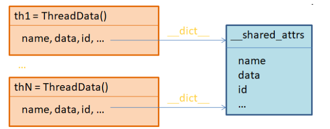

## Геттеры-сеттеры. Магия 

## Повторение 
```python
class SuperPoint:
    '''суперкласс'''

class Point(SuperPoint):
    ''' аннотация'''
    def __init__(self, x, y):
        self.x = x
        self.y = y

    def __repr__(self):
        return f'Точка ({self.x},{self.y})'

p1 = Point(2, 7)
p2 = Point(12, 7)


print(Point.__dict__) # '__module__': 

print(p1.__dict__) # {'x': 2, 'y': 7}
print(p1.__doc__) #  аннотация
print(Point.__name__) # Point
print(p1.__class__.__name__) # Point
print(Point.__base__) # <class 'object'>


print(Point.mro()) #<class '__main__.Point'>, <class '__main__.SuperPoint'>, <class 'object'>
print(issubclass(Point, SuperPoint))
print(issubclass(Point, object))
print(issubclass(list, object))
print(isinstance(Point, object))
print(isinstance(p1, object))
print(dir(Point))
```


`__str__()` – магический метод для отображения информации об объекте класса для пользователей (например, для функций print, str);

`__repr__()` – магический метод для отображения информации об объекте класса в режиме отладки (для разработчиков).
Чтобы лучше понять, как работают эти методы, объявим класс для описания кошек:

```python
class Cat:
    def __init__(self, name):
        self.name = name
```

Затем, создадим его экземпляр:
```python
cat = Cat('Васька')
```

При выводе cat, увидим служебную информацию:

> <ex1.Cat object at 0x0495D028>

<details>
<summary>Что такое 0x0495D028 ? </summary>

```python
print(hex(id(cat)))
print(f'{id(cat):X}')
```
</details>


Если нам нужно ее как-то переопределить и отобразить в другом виде (формате), то, как раз для этого используются магические методы `__str__` и `__repr__`. 

Давайте для начала переопределим метод `__repr__`и посмотрим, как это отразится на выводе служебной информации о классе:

```python
    def __repr__(self):
        return f"{self.__class__}: {self.name}"

```
Обратите внимание, этот метод должен возвращать строку, поэтому здесь записан оператор `return` и формируемая строка. 

Что именно возвращать, мы решаем сами, в данном случае – это название класса и имя кошки.

Переопределим измененный класс `Cat`. И, смотрите, теперь при создании экземпляра мы видим другую информацию при его выводе:


```python
<class 'ex1.Cat'>: Васька
```

Как раз то, что определили в магическом методе `__repr__`. 

То же самое увидим и при использовании функции `print` и `str`. 

По идее, здесь должен отрабатывать другой магический метод `__str__`, но так как он у нас еще не переопределен, то автоматически выполняется метод `__repr__`.

Давайте добавим второй магический метод `__str__` и посмотрим, как это повлияет на отображение данных:

```python
    def __str__(self):
        return f"{self.name}"
```

Снова переопределим класс `Cat`, создадим его экземпляр и при отображении ссылки:
```python
cat
```

```python
class Point:
   def __init__(self, x, y):
       self.__x = x
       self.__y = y
```

## Геттеры-сеттеры - 5 способов

### способ № 1. Типовой

```python
def get_coords(self):
     return self.__x, self.__y

def set_coords(self, x, y):
     self.__x = x
     self.__y = y


A = Point(1, 2)
print(A.get_coords())
print(A.get_coords())

A.set_coords(3, 4)
print(A.get_coords())
```

### способ № 2. Через функцию property

```python
def get_coords(self):
  return self.__x, self.__y

def set_coords(self, x, y):
    self.__x = x
    self.__y = y


coords = property(get_coords, set_coords)

A = Point(1, 2)

print(A.coords)

```

### способ № 3 Через декоратор @property

```python
@property
 def x(self):
    return self.__x
@x.setter
def x(self, x):
       self.__x = x

A = Point(1, 2)
A.x = 5
print(A.x)

```

### способ № 4* Через dataclass (ОО дизайн)

Также мы должны познакомиться с относительно новой идеей «быстрого» описания классов (классов данных – `Data Classes`). 

О чем здесь речь? Смотрите, довольно часто при объявлении классов в программах на `Python` приходится прописывать инициализатор, например, следующим образом:

```python
class Thing:
    def __init__(self, name, weight, price):
        self.name = name
        self.weight = weight
        self.price = price
```

То есть, передается несколько полей: `name, weight, price`, которые предполагается сохранять в объектах класса `Thing`. 
И это довольно типовая ситуация. Мало того, если создать объект этого класса и вывести его в консоль:

```python
t = Thing("Учебник по Python", 100, 1024)
print(t)
```
то увидим нечто неинформативное, вроде:

> <__main__.Thing object at 0x0000014B7D29A7D0>

Поэтому, опять же нередко, в таких классах с данными приходится прописывать магический метод `__repr__()`, например, так:

```python
    def __repr__(self):
        return f"Thing: {self.__dict__}"
```


Видите, сколько типовой писанины приходится делать для описания классов, подобных классу `Thing?`! 

И это лишь необходимый минимум. 
Представьте объем рутиной работы для описания всего лишь нескольких таких классов.

Так как программист, зачастую, существо глубоко ленивое, но творческое, уже давно предпринимались попытки автоматизировать этот процесс. 

И вот, начиная с версии Python 3.7, появилась возможность «из коробки» использовать инструмент для оптимизации объявления классов, содержащих произвольные данные, то есть,  `Data Classes`. 

Для этого, в самом простом варианте, достаточно импортировать специальный декоратор, который так и называется `dataclass`:

```python
from dataclasses import dataclass

@dataclass
class Point:
      x: int
      y: int

p1 = Point(1,2)

```

> особенность работы с dataclass
 при объявлении `Data Classes` атрибутам нельзя присваивать изменяемые объекты в качестве значений по умолчанию. 
 
 Например, следующее объявление приведет к ошибке:

```python
from dataclasses import dataclass

@dataclass
class Point:
    x: int
    y: int
    #   lst: list = [] # так не работает
    lst: list = field(default_factory=list)

p1 = Point(1,2)
p1.lst.append('привет')
print(p1)

```
Тогда спрашивается, как нам определить, например, список в качестве значения по умолчанию и так, чтобы он был независимым для каждого объекта класса  

Для этого следует воспользоваться специальной функцией `field()` из модуля `dataclasses`:
и определить через нее значение по умолчанию следующим образом:

Вычисляемые свойства в `dataclass`

```python
from dataclasses import dataclass

@dataclass
class Point:
    x: int
    y: int

    # вычисляемые свойства
    def __post_init__(self):
        print(self.x,self.y)
        self.length = (self.x ** 2 + self.y ** 2) ** 0.5

p1 = Point(1,2)
print(p1)

```
Результат:
> Point(x=1, y=2)

V3D(x=1, y=2, z=3)

Спрашивается, почему здесь не видно свойства length? 

В действительности, оно присутствует в объекте p1 и мы в этом легко можем убедиться:

```python
print(p1.__dict__) # увидим:

{'x': 1, 'y': 2, 'z': 3, 'length': 3.7416573867739413}
```
Но тогда почему оно не выводится функцией `repr()`? 

Дело в том, что магический метод `__repr__()` выводит только те атрибуты, которые были указаны при объявлении класса. 

Все остальные, что создаются в процессе формирования объекта, не учитываются в методе `__repr__()`. 

Как тогда выйти из этой ситуации и указать, что локальный атрибут `length` также следует отображать? 

Очень просто! Давайте укажем этот атрибут при объявлении класса с небольшим уточнением:

> length: float = field(init=False)

### Способ № 5 Патерн моносостояние (ОО дизайн)

Рассмотрим реализацию паттерна «Моносостояние», реализуемое на уровне классов и объектов. 
На примере этого паттерна в Python можно легко и гибко управлять локальными атрибутами экземпляров класса.



Вначале разберем саму идею «Моносостояния». 
Представьте, что у нас некий многопоточный процесс и в каждом потоке создается свой экземпляр класса ThreadData. Но нам бы хотелось, чтобы все они имели единые локальные свойства:

```python
class Point:
    coords = {
        'x' : 10,
        'y' : 20
    }

    def __init__(self):
        self.__dict__ = self.coords
```

## Классные методы (методы класса)

### Пример

```python
class Point:
    def __init__(self, x=0, y=0):
        self.x = x
        self.y = y

    def hello1():
        print('hello1')

    @staticmethod
    def hello2():
        print('hello2')
    

p1 = Point(2, 7)
p2 = Point(12, 7)


Point.hello1()
f = Point.hello1
f()
p1.hello2()
```


### Статические методы
Кроме обычных методов класс может определять статические методы. Такие методы предваряются аннотацией `@staticmethod` и относятся в целом к классу. Статические методы обычно определяют поведение, которое не зависит от конкретного объекта:


```python
class Person:
    __type = "Person"
 
    @staticmethod
    def print_type():
        print(Person.__type)
 
 
Person.print_type()     # Person - обращение к статическому методу через имя класса
 
tom = Person()
tom.print_type()     # Person - обращение к статическому методу через имя объекта
```

В данном случае в классе Person определен атрибут класса `__type`, который хранит значение, общее для всего класса - название класса. 

Причем поскольку название атрибута предваряется двумя подчеркиваниями, то данный атрибут будет приватным, что защитит от недопустимого изменения.

Также в классе Person определен статический метод print_type, который выводит на консоль значение атрибута `__type`. 

Действие этого метода не зависит от конкретного объекта и относится в целом ко всему классу - вне зависимости от объекта на консоль будет выводится одно и то же значение атрибута `__type. Поэтому такой метод можно сделать статическим.


```python
class ИмяКласса:
    атрибут_класса = 0

    @staticmethod
    def static_method():
        return ИмяКласса.атрибут_класса

    @classmethod
    def class_method(cls):
        return cls.атрибут_класса

объект = ИмяКласса()

объект.static_method()
объект.class_method()
```

Технической между ними разницы нет. 

Есть синтаксическая разница. Если мы используем декоратор `@staticmethod` то обращение идет к классу через точку его метод.

```python
    @staticmethod
    def static_method():
        return Lamp.count

    @classmethod
    def class_method(cls):
        return cls.count


print (lamp1.static_method())
print (lamp1.class_method())
```

Таким образом 
```python
class Lamp:
    brand = "Philips"
    count = 0
    def __init__(self, floor=0):
        self.__state = False
        self.__floor = floor
        Lamp.count +=1
        print(f'Создана лампочка {Lamp.brand} № {Lamp.count}' )
```


Некая переменная в которую прилетает имя класса, по соглашению, по конвенции – название её `cls` ( по аналогии `self`).

В первом случае имя класс мы пишем руками.

Никакого `self`. Но какая возникает проблема.

Подумайте, если мы поменяем имя класса. Что это значит?

Нам нужно будет поменять имя класса во всех статических методах.

В случае с класс-методами – этого делать не нужно.

Разница в терминах ООП никакой. Кроме того, что необходимо менять название в статик-методах.

Ну и, соответственно, внутри класса мы не можем обращаться к каким-либо объектам. Только к классу.

К общему поведению всех объектов.

Т.е класс – это тоже самостоятельная единица.
Иногда класс используется просто как коробка методов
```python
class Math3D:
    PI = 3.14
    @classmethod
    def cos(n):
        pass

    @classmethod
    def sin(n):
        pass

Math3D.cos(2)
```

т.е когда мы будем вызывать методы, без создания экземпляров данного класса.

Там могут просто лежать некие алгоритмы.


## P.S.

На самом деле, в Python можно относительно легко обратиться и к приватным атрибутам извне. Если распечатать все атрибуты экземпляра:

```python
print(dir(lamp1))
```
то среди прочих мы увидим, следующие:

`'_Lamp__floor', '_Lamp__state'`

Это и есть кодовые имена приватных атрибутов, к которым мы можем обратиться через ссылку `lamp1`:

```python
print(lamp1._Lamp__state)
```
и менять их. 

Однако, так делать крайне не рекомендуется и двойное подчеркивание должно сигнализировать программисту, что работать с такими атрибутами нужно только через разрешенные интерфейсные методы.

Иначе, возможны непредвиденные ошибки.

Если у вас появилась необходимость лучше защитить методы класса от доступа извне, то это можно сделать с помощью модуля `accessify`. Для его установки нужно выполнить команду:

pip install accessify

И, затем, импортировать из него два декоратора:
```
from accessify import private, protected
```

Далее, нужный декоратор просто применяем к методу и он становится либо приватным (private), либо защищенным (protected):
```python
    @private
    @classmethod
    def check_value(cls, x):
        return type(x) in (int, float)
```
Все, теперь мы можем обратиться к check_value только внутри класса, но не извне


### Выводы:
* реализация режимов доступа `public, protected и private`,
* правильное обращение  скрытым атрибутам через интерфейсные методы – сеттеры и геттеры.