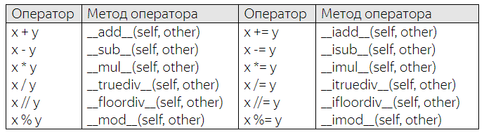

## Магические методы __str__, __repr__, __len__, __abs__


Продолжим рассмотрения магических методов, которые определены в каждом классе и записываются через два подчеркивания вначале и в конце имен, например, так:

`__str__, __repr__`

Их еще называют

`dunder-методами (от англ. сокращения double underscope)`

Каждый магический метод автоматически срабатывает в определенный момент времени, например:

`__str__()` – магический метод для отображения информации об объекте класса для пользователей (например, для функций print, str);

`__repr__()` – магический метод для отображения информации об объекте класса в режиме отладки (для разработчиков).
Чтобы лучше понять, как работают эти методы, объявим класс для описания кошек:


```python
class Cat:
    def __init__(self, name):
        self.name = name
```

Перейдем в консоль Python, скопируем (определим) этот класс. Затем, создадим его экземпляр:
```python
cat = Cat('Васька')
```
При выводе cat, увидим служебную информацию:

> <ex1.Cat object at 0x0495D028>

Если нам нужно ее как-то переопределить и отобразить в другом виде (формате), то, как раз для этого используются магические методы `__str__` и `__repr__`. 

Давайте для начала переопределим метод `__repr__` и посмотрим, как это отразится на выводе служебной информации о классе:

```python
    def __repr__(self):
        return f"{self.__class__}: {self.name}"
```
Обратите внимание, этот метод должен возвращать строку, поэтому здесь записан оператор return и формируемая строка. 

Что именно возвращать, мы решаем сами, в данном случае – это название класса и имя кошки.

Переопределим измененный класс Cat. И, смотрите, теперь при создании экземпляра мы видим другую информацию при его выводе:

> <class 'ex1.Cat'>: Васька

Как раз то, что определили в магическом методе `__repr__`. То же самое увидим и при использовании функции print и str. По идее, здесь должен отрабатывать другой магический метод `__str__`, но так как он у нас еще не переопределен, то автоматически выполняется метод `__repr__`.

Давайте добавим второй магический метод `__str__` и посмотрим, как это повлияет на отображение данных:

```python
    def __str__(self):
        return f"{self.name}"
```

Снова переопределим класс Cat, создадим его экземпляр и при отображении ссылки:

> cat

по-прежнему будем видеть служебную информацию от метода `__repr__`. 

 Однако, если выполнить отображение экземпляра класса через `print` или `str`, то будет срабатывать уже второй метод `__str__`. Вот в этом отличие этих двух магических методов.

### Магические методы `__len__` и `__abs__`
Следующие два магических метода:

`__len__()` – позволяет применять функцию `len()` к экземплярам класса;
`__abs__()` - позволяет применять функцию `abs()` к экземплярам класса.

Их использование достаточно простое и очевидное. 

Давайте для примера представим, что у нас есть класс Point, который может хранить произвольный вектор координат точек, и определим его так:

```python
class Point:
    def __init__(self, *args):
        self.__coords = args
```

А, далее, по программе нам бы хотелось определять размерность координат с помощью функции len(), следующим образом:

```python
p = Point(1, 2)
print(len(p))
```

Если сейчас запустить программу, то увидим ошибку, так как функция len не применима к экземплярам классов по умолчанию. 

Как вы уже догадались, чтобы изменить это поведение, можно переопределить магический метод `__len__()` и в нашем случае это можно сделать так:

```python
    def __len__(self):
        return len(self.__coords)
```
Смотрите, мы здесь возвращаем размер списка `__coords` и если после этого запустить программу, то как раз это значение и будет выведено в консоль. 

То есть, магический метод `__len__ `указал, что нужно возвращать, в момент применения функции `len()` к экземпляру класса. Как видите, все просто и очевидно.

Следующий магический метод `__abs__` работает аналогичным образом, только активируется в момент вызова функции abs для экземпляра класса, например, так:
```python
print(abs(p))
```
Опять же, если сейчас выполнить программу, то увидим ошибку, т.к. функция abs не может быть напрямую применена к экземпляру. 

Но, если переопределить магический метод:
```python
    def __abs__(self):
        return list( map(abs, self.__coords) )
```

который возвращает список из абсолютных значений координат точки, то программа отработает в штатном режиме и мы увидим ожидаемый результат.

Вот так можно использовать эти два магических метода. Я, надеюсь, из этого занятия вы узнали, зачем нужны и как можно реализовывать в своих классах четыре магических метода:

#### `__str__, __repr__, __len__, __abs__`


Далее расмотрим наиболее употребительными магические методы  для работы с арифметическими операторами:

```
__add__() – для операции сложения;
__sub__() – для операции вычитания;
__mul__() – для операции умножения;
__truediv__() – для операции деления.
```

Как всегда, объяснить работу этих методов проще всего на конкретном примере. 

Предположим, что мы создаем класс для работы со временем. 

Его экземпляры будут хранить часы, минуты и секунды текущего дня. Начальной точкой отсчета будет 00:00 часов ночи. 

Время будем хранить в виде секунд с максимальным значением 86400 – число секунд в одном дне. 

Поэтому перед присвоением в инициализаторе будем брать остаток от деления на это значение:

```python
class Clock:
    __DAY = 86400   # число секунд в одном дне
 
    def __init__(self, seconds: int):
        if not isinstance(seconds, int):
            raise TypeError("Секунды должны быть целым числом")
        self.seconds = seconds % self.__DAY
```

Обратите внимание как записан параметр `seconds`. 

После него стоит двоеточие и указан ожидаемый тип данных. Эта нотация языка Python подсказывает программисту, какой тип данных следует передавать в качестве seconds. 

Конечно, мы можем передавать и другие типы данных, строгого ограничения здесь нет, это лишь пометка для программиста и не более того. 

Поэтому далее внутри инициализатора мы делаем проверку, что параметр seconds должен являться целым числом. 

Если это не так, генерируем исключение `TypeError`.

Далее в этом же классе пропишем метод get_time для получения текущего времени в виде форматной строки:

```python
    def get_time(self):
        s = self.seconds % 60            # секунды
        m = (self.seconds // 60) % 60    # минуты
        h = (self.seconds // 3600) % 24  # часы
        return f"{self.__get_formatted(h)}:{self.__get_formatted(m)}:{self.__get_formatted(s)}"
 
    @classmethod
    def __get_formatted(cls, x):
        return str(x).rjust(2, "0")
```

Здесь дополнительно определен метод класса для форматирования времени (добавляется незначащий первый ноль, если число меньше 10).

Далее, мы можем воспользоваться этим классом, например, так:

```python
c1 = Clock(1000)
print(c1.get_time())
```

Если же нам понадобиться изменить время в объекте c1, то сейчас это можно сделать через локальное свойство seconds:

> c1.seconds = c1.seconds + 100

Мы добавили 100 секунд. Но было бы здорово если бы это изменение можно было бы прописать вот так:

> c1 = c1 + 100


Конечно, при запуске программы возникнет ошибка, так как оператор сложения не работает с экземплярами класса Clock. Однако, это можно поправить, если добавить в наш класс магический метод `__add__`. 

Я запишу его в следующем виде:

```python
    def __add__(self, other):
        if not isinstance(other, int):
            raise ArithmeticError("Правый операнд должен быть типом int")
 
        return Clock(self.seconds + other)
```


И теперь, при запуске программы, все работает так, как и задумывалось. Давайте разберем этот момент подробнее.

Вначале у нас есть объект класса Clock со значением секунд 1000. 

Затем, арифметическая операция c1 = c1 + 100 фактически означает выполнение команды:

```python
с1 = c1.__add__(100)
```
В результате, активируется метод `__add__` и параметр `other` принимает целочисленное значение 100. 

Проверка проходит и формируется новый объект класса `Clock` со значением секунд `1000+100 = 1100`. 

Этот объект возвращается методом `__add__` и переменная `c1` начинает ссылаться на этот новый экземпляр класса.

На прежний уже не будет никаких внешних ссылок, поэтому он будет автоматически удален сборщиком мусора.

Вас может удивить сложность процессов, когда нам всего лишь нужно прибавить 100 секунд к уже имеющемуся значению.

Но эта сложность оправданна.

Чтобы это понять, мы расширим функционал оператора сложения и допустим, что можно складывать два разных объекта класса `Clock`, следующим образом:

```python
c1 = Clock(1000)
c2 = Clock(2000)
c3 = c1 + c2
print(c3.get_time())
```

Конечно, если сейчас запустить программу, то увидим ошибку `ArithmeticError`, так как параметр `other` не соответствует целому числу. Поправим это и немного изменим реализацию метода `__add__`:

```python
    def __add__(self, other):
        if not isinstance(other, (int, Clock)):
            raise ArithmeticError("Правый операнд должен быть типом int или объектом Clock")
 
        sc = other if isinstance(other, int) else other.seconds
        return Clock(self.seconds + sc)
```

Теперь, в программе можно складывать и отдельные целые числа и объекты классов `Clock`.
Видите, как это удобно!

Кроме того, мы можем прописывать и более сложные конструкции при сложении, например, такие:

```python
c1 = Clock(1000)
c2 = Clock(2000)
c3 = Clock(3000)
c4 = c1 + c2 + c3
print(c4.get_time())
```

И она сработала благодаря тому, что метод `__add__` возвращает каждый раз новый экземпляр класса Clock. 

Детальнее все выглядит так.

Сначала идет сложение объектов `c1 + c2`, в результате формируется новый объект класса Clock со значением секунд `1000 + 2000 = 3000`. 

Пусть на этот класс ведет внутренняя переменная t1. 

Затем, для этого нового объекта вызывается снова метод `__add__` и идет сложение с объектом t1 + c3. 

Получаем еще один объект с числом секунд `6000`. На этот объект, как раз и будет ссылаться переменная `c4`, а объект с `t1` будет автоматически уничтожен сборщиком мусора.


Если бы мы не создавали экземпляры классов Clock в методе `__add__` и не возвращали их, то конструкцию с двумя сложениями было бы невозможно реализовать.

Еще одним важным нюансом работы оператора сложения для объектов классов, является порядок их записи. Мы всегда прописывали его в виде:

> c1 = c1 + 100

то есть, сначала шел объект, а затем, число. Если записать наоборот, то возникнет ошибка:

> c1 = 100 + c1

и это очевидно, так как здесь, фактически идет вызов метода:

```python
100.__add__(c1)
```

но он не существует для объекта int и экземпляров класса Clock. Как выйти из этой ситуации? Очень просто. Язык Python предоставляет нам специальный набор магических методов с добавлением буквы r:

```python
__radd__()
```

Он автоматически вызывается, если не может быть вызван метод `__add__()`. 

Давайте добавим его определение в наш класс `Clock`:

```python
    def __radd__(self, other):
        return self + other
```

Смотрите, мы здесь записали команду сложения текущего объекта класса Clock с параметром other, который может быть или числом или тоже объектом класса Clock.

В свою очередь будет вызван метод `__add__`, но с правильным порядком типов данных, поэтому сложение пройдет без ошибок.

Наконец, у всех магических методов, связанных с арифметическими операторами, есть еще одна модификация с первой буквой i:

`__iadd__()`


Она вызывается для команды:

> c1 += 100


Если запустить сейчас программу, то никаких ошибок не будет и отработает метод `__add__()`. Но в методе `__add__` создается новый объект класса `Clock`, тогда как при операции += этого делать не обязательно. Поэтому я добавлю еще один магический метод `__iadd__` в наш класс `Clock`:

```python
    def __iadd__(self, other):
        print("__iadd__")
        if not isinstance(other, (int, Clock)):
            raise ArithmeticError("Правый операнд должен быть типом int или объектом Clock")
 
        sc = other if isinstance(other, int) else other.seconds
        self.seconds += sc
 
        return self
```

Смотрите, мы здесь не создаем нового объекта, а меняем число секунд в текущем. 

Это логичнее, так как вызывать цепочкой операцию += не предполагается и, кроме того, она изменяет (по смыслу) состояние текущего объекта. Поэтому я посчитал правильным добавить этот магический метод.

Вот мы с вами подробно рассмотрели работу одного арифметического магического метода `__add__()` с его вариациями `__radd__()` и `__iadd__()`.

По аналогии используются и все остальные подобные магические методы:



Предлагаю вам в качестве самостоятельного задания добавить некоторые из них в класс Clock по аналогии с методами __add__(). 

При этом обращайте внимание на недопустимость дублирования кода. 

Оно произойдет, если вы «в лоб» будете прописывать другие арифметические магические методы. 

Подумайте, как все сделать правильно.