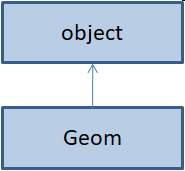
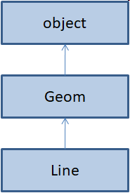
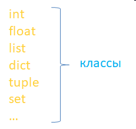

Пользовательский класс по умолчанию автоматически наследуется от базового класса `object` языка `Python`. 

Например, если записать некий класс Geom без какой-либо реализации:

```python
class Geom:
    pass
```
то, смотрите, в среде PyCharm записав ниже «Geom.» мы увидим список различных методов и свойств. 

Например, можно вывести значение свойства `__class__`:

```python
print(Geom.__class__)
```

Откуда все это взялось? 

Как вы уже догадались, от базового класса object, который неявно добавляется, начиная с версии языка Python 3.

Это эквивалентно такой записи:
```python
class Geom(object):
    pass
```

И все эти атрибуты находятся в классе object.

Зачем это было сделано? 

Очевидно, чтобы обеспечить стандартный базовый функционал работы с классами. 

В частности, когда мы создаем экземпляр класса:
```python
g = Geom()
```
а, затем, выводим его с помощью функции `print`:

```python
print(g)
```

то автоматически отрабатывает магический метод `__str__`, который определен в базовом классе object. И так со всеми атрибутами, ничего лишнего там нет. 

Как вы понимаете, иметь такой базовый функционал очень удобно, поэтому в Python происходит такое наследование по умолчанию от object. 

В результате, мы имеем иерархию наследования:




Однако, если добавить дочерний класс от Geom, например, класс Line для представления линии:

```python
class Geom(object):
    pass
 
 
class Line(Geom):
    pass
```

то иерархия наследования уже будет такой:




То есть, указывая в качестве базового любой другой класс, непосредственное наследование от object уже не происходит, только косвенное – через базовые классы. 

Разумеется, здесь объекты Line также имеют полный доступ ко всем открытым атрибутам класса object:

```python
l = Line()
print(l.__class__)
```

Мало того, мы можем определять, является ли тот или иной класс подклассом другого класса. 

Это делает функция issubclass(), например:

```python
print(issubclass(Line, Geom))
```

Она возвращает значение True, если класс Line является подклассом класса Geom. 

А вот если указать их в другом порядке:

```python
print(issubclass(Geom, Line))
```

то получим `False`, так как класс `Geom` не является дочерним от класса `Line`.

А вот с объектами классов эта функция не работает. Если записать:

```python
print(issubclass(l, Geom))
```

то получим ошибку, что аргумент должен быть классом, а не его экземпляром. 

Если нам все же нужно проверить принадлежность объекта тому или иному классу, в том числе и базовому, то следует использовать уже знакомую нам функцию `isinstance()`:

```python
print(isinstance(l, Geom))
print(isinstance(l, Line))
```

В обоих случаях получим значение `True`. 

Также истину вернет и проверка на базовый класс object:

```python
print(isinstance(l, object))
```

Это еще раз показывает, что все классы неявно наследуются от `object`.

### Наследование от встроенных типов данных

Интересный факт языка Python, что все стандартные типы данных являются классами:



Мы в этом легко можем убедиться, если выполним для них функцию issubclass():

```python
issubclass(int, object)
issubclass(list, object)
```

Всюду увидим `True`. 

А мы знаем, что эта функция работает исключительно с классами, а не объектами, поэтому данный факт подтверждает, что эти типы являются классами языка Python.

Раз это так, то что нам мешает наследоваться от них и расширять функционал по мере необходимости? Ничего, поэтому можно сделать, например, такую реализацию:

```python
class Vector(list):
    def __str__(self):
        return " ".join(map(str, self))
 
 
v = Vector([1, 2, 3])
print(v)
```

Мы здесь переопределили магический метод `__str__` для вывода списка в виде набора данных через пробел. 

Мало того, теперь тип данных нашего списка стал не `list`, а Vector:
```python

print(type(v))
```

увидим:

`<class '__main__.Vector'>`

Конечно, стандартные типы данных редко расширяют с помощью пользовательских классов, но понимать, что они представляют собой классы и что такая возможность в принципе существует, важно.

Итак, из этого вы должны были узнать, что все классы по умолчанию наследуются от базового класса `object`, как работает функция `issubclass()` и что из себя представляют встроенные типы данных языка Python.