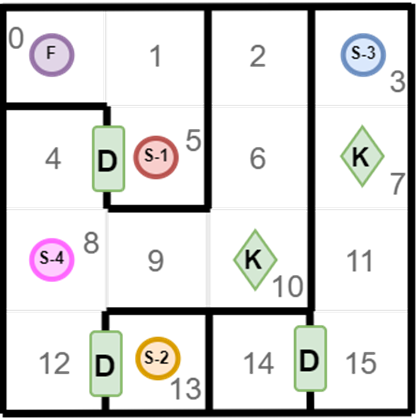

## Домашка 

### Задача 1
Имеются кубические контейнеры двух цветов различного размера.
```
19677 A
5416 A
4889 A
14233 A
13749 B
1288 A
5794 A
18584 B
14668 A
17900 B
12915 B
```

Чтобы сократить занимаемое при хранении место, контейнеры вкладывают друг в друга.

Чтобы вложенные контейнеры было лучше видно, их цвета при вложении обязательно должны чередоваться, то есть нельзя вкладывать контейнер в контейнер такого же цвета.

Один контейнер можно вложить в другой, если размер стороны внешнего контейнера превышает размер стороны внутреннего на 5 и более условных единиц.

Группу вложенных друг в друга контейнеров называют блоком. Количество контейнеров в блоке может быть любым.

Каждый блок, независимо от количества и размера входящих в него контейнеров, а также каждый одиночный контейнер, не входящий в блоки, занимает при хранении одну складскую ячейку.

Зная размеры и цвета всех контейнеров, определите максимально возможное количество контейнеров в одном блоке и минимальное количество ячеек для хранения всех контейнеров.

Входные данные взять из файла:

[Контейнеры.txt](boxes1.txt)

Каждая строка входного файла содержит натуральное число и букву A или B.

Число обозначает размер контейнера в условных единицах, буква  — цвет этого контейнера (буквами A и B условно обозначены два цвета).

В ответе запишите два целых числа: сначала максимально возможное количество контейнеров в одном блоке, затем минимальное количество ячеек для хранения всех контейнеров.

> Ответ: 2326 187


### Задача 2.

Решить задачу (подумать как можно смоделировать двери), используя существующие алгоритмы работы с графами.



Посетив клетку K, можно подобрать ключ, который отпирают любую дверь(D). 
Любым ключом можно открыть любое количество дверей
Выведите ответ в формате:

* Из точки S… можно добраться до финиша, используя ключ ... 
* Из точки S… можно добраться до финиша без ключа
* Из точки S… нельзя добраться до финиша


### Задача 3. Лабиринт с сокровищами


Розовые кубы - сокровища. 
Цифра на них - их ценность
Стартовав из каждой точки вы можете собрать только по два сокровища(больше не унести)
На какую суммарную ценность можно собрать сокровищ, стартовав из разных точек?
Выведите ответ в формате:
Из точки S-... можно собрать сокровищ суммарной ценностью ... 
Из точки S-... можно собрать сокровищ суммарной ценностью ...
