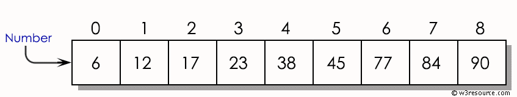
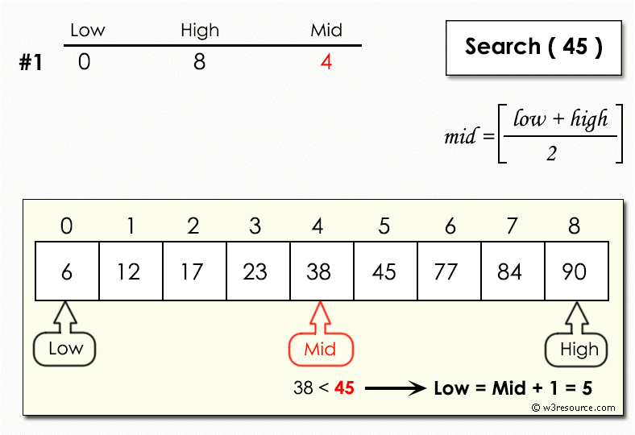
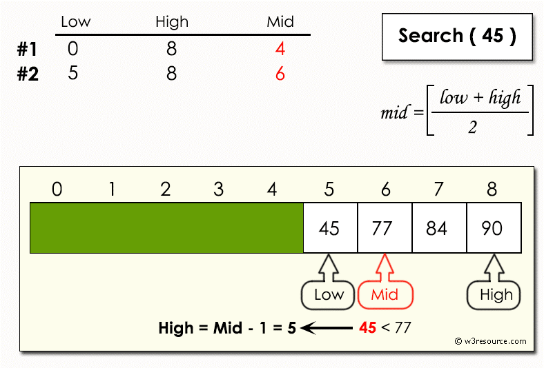
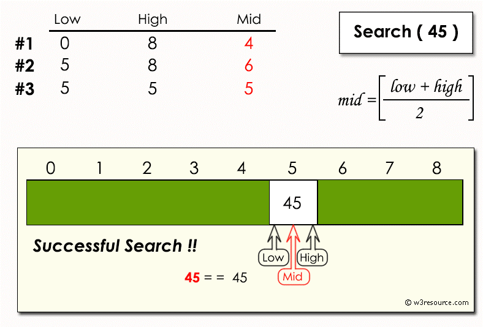
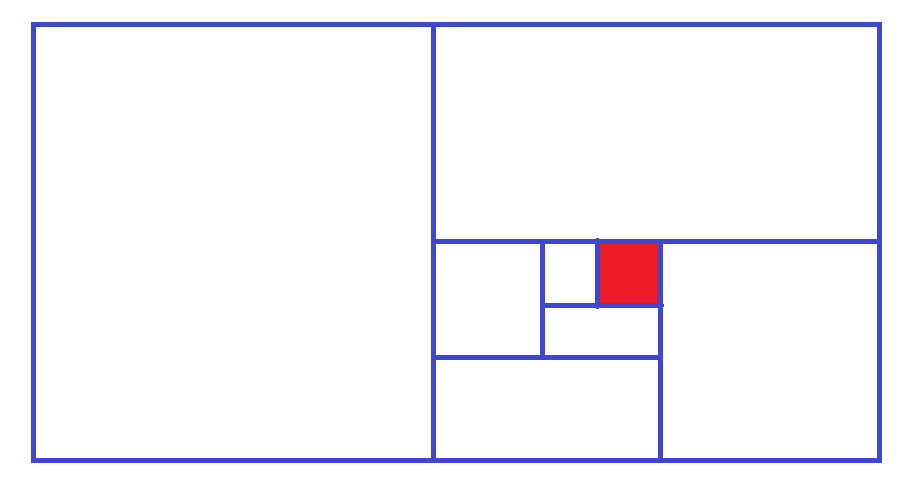

## Алгоритмы поиска


### Введение


Поиск информации, хранящейся в различных структурах данных, является важной частью практически каждого приложения.

Существует множество различных алгоритмов, которые можно использовать для поиска. 

Каждый из них имеет разные реализации и напрямую зависит от структуры данных, для которой он реализован.

Умение выбрать нужный алгоритм для конкретной задачи является ключевым навыком для разработчиков. 

Именно правильно подобранный алгоритм отличает быстрое, надежное и стабильное приложение от приложения, которое падает от простого запроса.

В `Python` самый простой способ поиска объекта — использовать операторы членства. 

Их название связано с тем, что они позволяют нам определить, является ли данный объект членом коллекции.

Эти операторы могут использоваться с любой итерируемой структурой данных в `Python`, включая строки, списки и кортежи.

Операторов членства достаточно, если нам нужно только определить, существует ли подстрока в данной строке, или пересекаются ли две строки, два списка или кортежа с точки зрения содержащихся  в них объектов.

В большинстве случаев помимо определения, наличествует ли элемент в последовательности, нам нужна еще и позиция (индекс) элемента. 

Используя операторы членства, мы не можем получить ее.


Последовательный (линейный) поиск


```python
'apple' in ['orange', 'apple', 'grape']
't' in 'python'
'q' not in 'python'
```

Существует множество алгоритмов поиска, которые не зависят от встроенных операторов и могут использоваться для более быстрого и/или эффективного поиска значений.

Кроме того, они могут дать больше информации (например, о позиции элемента в коллекции), а не просто определить, есть ли в коллекции этот элемент.

## Бинарный поиск (случайного числа)


```python
a, b = 0, 100

print("Я загадал", x := randint(a, b))

## тупой поиск

while (y := randint(a, b)) != x:
    print(y)
    time.sleep(0.1)

print(y)
```

Какова сложность алгоритма?

Давайте оптимизировать
```python
while x != y:

    if x < y:
        
    else:
      
    time.sleep(0.5)
```

Сложность алгоритма 

> x = 3 * log10(100)

## Линейный поиск

Линейный поиск — это один из самых простых и понятных алгоритмов поиска. 

Мы можем думать о нем как о расширенной версии нашей собственной реализации оператора `in` в `Python`.

Суть алгоритма заключается в том, чтобы перебрать массив и вернуть индекс первого вхождения элемента, когда он найден.
Обычно, то что нам нужно найти, называют ключом. 

В обыденной жизни ключом является ключ словаря 

> {'key': value}.
Для списка ключом является

```
  0      1
['a', 'b']
```
Значение ‘b’

Алгоритм линейного последовательного поиска довольно прост. Функция принимает сам список и ключ (значение) который мы ищем

Последовательный (линейный) поиск

```python
def linear_search(lst, key):
    for idx, item in enumerate(lst):
        if key == item:
            return idx
    return -1
```

Таким образом, начиная с первого элемента, от значения к значению, мы слева-направо, следуя внутреннему порядку последовательности.

Цикл `for` и функция `enumerate` позволяет получать сразу два значения.

Функция позволяет получить позицию (индекс ключа). 
На каждой итерации мы тупо сравниваем. 

В случае совпадения мы возвращаем индекс, по которому он находится, пока не достигнем последнего элемента.
Когда мы не нашли элемент в последовательности, то возвращаем -1. Т.е. она не содержит. 

```python
t = [1, 2, 32, 43, 54]
print(linear_search(t,32))
```


Протестим алгоритм линейного поиска.

Далее мы должны проанализировать этот алгоритм.
Маленький, не означает быстрый. 

Что нужно взять за шаг? 
Количество сравнений.
Учитываем, что список неупорядоченный. 

Элементы размещены случайны.

Вероятность найти нужный нам ключ примерно одинакова.

Если в списке n-чисел, то нам потребуется n-сравнений, чтобы убедится, что там нет нужного элемента.

А если этот элемент есть – какие варианты. 

Если элемент находится на 1-позиции – нам потребуется всего одно сравнение.

В середине `n/2` – сравнений.

По сути получаем линейную зависимость

Элемент | +  |  -  | +/-
------| --|--|------------
Есть  |   1  |  n  |  n/2
Нет   |   n  |  n  |  n


Если элемент присутствует – наилучший случай – это константа, наихудший – это `n`, средний `n/2`. 

При отсутствии элемента – всегда будет наихудшая n.

Для больших `n – n/2` стремится к n. 

Аппроксимируем до сложности `O(n)`.

А если список будет отсортирован, 




Линейный поиск в отсортированном списке выглядит теперь вот так:

```python
def ordered_linear_search(lst, key):
    for idx, item in enumerate(lst):
        if item == key:
            return idx
        elif item > key:
            return -1
        return -1
```

Казалось бы нам нужно тоже самое количество сравнений для поиска.

Но обратите внимание, в случае если элемент у нас отсутствует, у нас появляется некий профит. Какой ?

Мы сравниваем последовательно, до какого-то числа.
В этот момент у нас есть информация. 

Например, мы ищем число `14`.

Когда мы дошли до числа `17`, мы видим, что `17` явно больше `14`. Смысла искать дальше те до конца. 

```python
elif item > key: 
    return -1
```

Анализ

Элемент |  +   | -   | +/-
-------|--------|----|----------
Есть   |      1  |  n  |  n/2
Нет    |      n  |  n  |  n/2


Показывает, что усредненная сложность везде будет `n/2`.  Чуть лучше!

Но не идеально. Можем перейти к  бинарному (или двоичном) поиску! 

Но в отсортированном списке.

## Бинарный поиск в отсортированном списке

Бинарный поиск работает по принципу «разделяй и властвуй». 

Он быстрее, чем линейный поиск, но требует, чтобы массив был отсортирован перед выполнением алгоритма.




Идея с следующем.

Начинаем искать с середины. 

Получаем список, режим его пополам, сравниваем среднее число (Mid). 
Если совпало с ключем, то возвращаем его, если нет, то мы смело можем исключить сразу половину (левую или правую) списка.
Т.е. если середина списка 38, а мы ищем 45, которое расположено в правой части списка, то левую половину, включая число 38, мы можем больше не рассматривать (исключить, удалить). Т.к. 45 > 38.



И тоже самое повторяем с оставшейся частью списка, делим пополам, проверяем, удаляем половину списка.

Т.о. с третьей попытки мы находим нужный ключ в искомой коллекции.





Реализация на Пайтон.

```python
def binary_search(lst, key):
    first = 0
    last = len(lst) - 1

    while first <= last:
        mid = (first + last) // 2
        if lst[mid] == key:
            return mid
        else:
            if key < lst[mid]:
                last = mid - 1
            else:
                first = mid + 1
    return -1

```

Известная вещь. Игра угадай число. Как за меньшее число попыток угадать число.

То же использует в себе бинарный (двоичный) поиск.

Для анализа этого алгоритма строим табличку. И получаем сложность `O(log n)`.

Логарифмическая сложность, т.к. каждый раз делим список пополам.


Элемент  | +  |        -    |   +/-
--------|-------|-----------|-------------
Есть    |     1     |   log n  |  log n
Нет     |     log n |   log n  |  log n

Мы вторглись на территорию стратегии «Разделяй и властвуй».
Хрестоматийная задача – поле, которое нужно разбить на квадраты.

Найти минимальный квадрат



Вообще мы можем в данной ситуации обойтись без цикла. Хотя наш алгоритм имеет хороший `O(log n)`.

Но это в следующем разделе нашего модуля. Использование рекурсии


### Выводы по алгоритмам поиска

Поиск является одной из важнейших процедур обработки структурированной информации

Асимптотическая сложность алгоритма линейного поиска — `O(n)`
Асимптотическая сложность алгоритма бинарного поиска для упорядоченных списков — `O(log n)`
