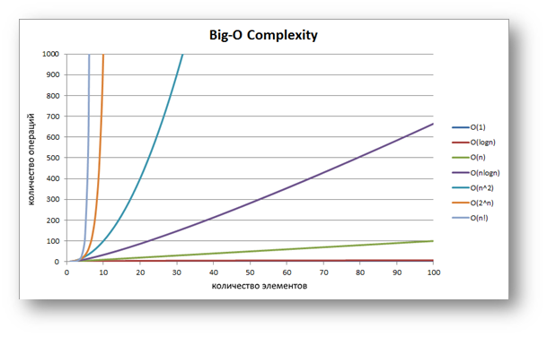
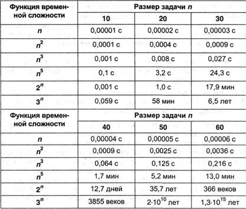

## Шаблоны проектирования (паттерны банды четырех)

Философия Python базируется на хорошо продуманных лучших практиках программирования.

Многие шаблоны проектирования уже встроены в язык. 

Разработчики используют их, даже не задумываясь.

Ряд популярных паттернов очень легко реализовать благодаря динамической природе языка.

А некоторые не используются в Python, так как в них нет необходимости.

Python является объектно-ориентированным языком, однако прекрасно поддерживает функциональный стиль программирования. 

Разработчик вовсе не обязан создавать классы и их экземпляры. Если проекту не нужны сложные структуры, нет необходимости их строить. 

Можно просто писать функции или даже совсем не структурированный код, чтобы быстро выполнять несложные задачи. В то же время, все элементы языка – это объекты. Даже функции, которые являются "объектами первого класса".

### Что такое шаблоны проектирования?

Все началось с Банды четырех. Именно они сформулировали и подробно описали ряд способов решения распространенных проблем программирования. 

Концепцию паттернов впервые описал Кристофер Александер в книге «Язык шаблонов. Города. Здания. Строительство».

Идея показалась привлекательной авторам Эриху Гамму, Ричарду Хелму, Ральфу Джонсону и Джону Влиссидесу, их принято называть «бандой четырёх» (Gang of Four). 

В 1995 году они написали книгу «Design Patterns: Elements of Reusable Object-Oriented Software», в которой применили концепцию типовых паттернов в программировании. 

В книгу вошли 23 паттерна, решающие различные проблемы объектно-ориентированного дизайна.

В их основу были положены два принципа:
Программировать нужно для интерфейсов, а не для конкретных реализаций.

Композицию следует предпочитать наследованию.

Паттерны проектирования можно разделить по трем типам:
* Паттерны порождающего типа (Creational patterns):
отвечают за удобное и безопасное создание новых объектов или инстанцирование классов используя наследование или композицию.

* Паттерны структурного типа (Structural patterns): позволяют определять отношения между различными элементами системы для создания более сложных структур.

* Паттерны поведенческого типа (Behavioral patterns): определяют взаимодействие между объектами и классами системы и делятся на уровни объектов, классов и взаимодействующих объектов и классов.

Вообще правила, созданы для того, чтобы их улучшать и/или нарушать

Шаблон перехода дороги – остановись посмотри налево, потом направо, убедись, что безопасно, потом иди. А если дорога 4 полоска, а если дорога автомагистраль.

Согласно стандартного шаблона вы должны уже её перейти, а вы зависли в потоке машин.

Любое шаблон – это руководство к действию. А шаблонов много, банда 4-х придумала их целых 23.

Например, смысл шаблона Фабрика – скрывать логику создания новых объектов. 

Но в Python это не нужно, так как этот процесс динамичен по своей сути. 

Конечно, Фабрику можно реализовать, если есть желание. 

Иногда это действительно полезно, но такие случаи – больше исключение, нежели правило.
