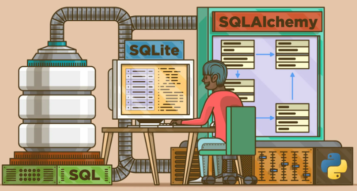
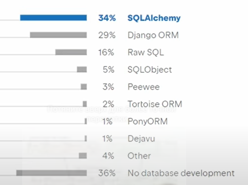
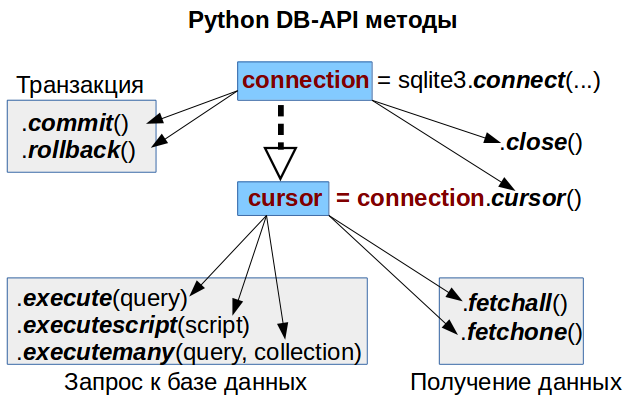

## Введение 

Приложение на языке Python может использовать различные базы данных - SQLite, PostgreSQL и т.д. 

Но при работе с каждой конкретной системой базой данных мы вынуждены писать запросы на языке SQL, соответственно возникает необходимость владения данным языком.

Кроме того, если мы захотим легко и быстро перейти с одной СУБД к другой, то, возможно, нам потребуется внести немало изменений в настройку подключения, синтаксис запросов, поскольку диалекты SQL в разных СУБД могут отличаться. 

Чтобы решить эти проблемы, применяются специальные ORM-библиотеки (Object Relational Mapper), которые позволяют абстрагироваться от строения конкретной базы данных и позволяют работать с данными как с объектами стандартных классов Python. 

Для языка Python одной из наиболее популярных ORM-библиотек является SQLAlchemy

Официально поддерживаются все наиболее популярные системы баз данных: `PostgreSQL, MySQL, MariaDB, SQLite, Oracle и Microsoft SQL Server`. 

`Python DB-API` – это не конкретная библиотека, а набор правил, которым подчиняются отдельные модули, реализующие работу с конкретными базами данных. 

Отдельные нюансы реализации для разных баз могут отличаться, но общие принципы позволяют использовать один и тот же подход при работе с разными базами данных.

Python имеет встроенную поддержку SQLite базы данных, для этого вам не надо ничего дополнительно устанавливать, достаточно в скрипте указать импорт стандартной библиотеки

## Общие понятия ORM

В нашем коде мы работаем с объектами разной природы, а при работе с SQL базой данных мы вынуждены постоянно генерировать текстовые запросы к базе, а получив ответ от базы обратно его преобразовывать в формат данных нашего приложения.

Хорошо было бы иметь некий механизм автоматического генерирования этих запросов исходя из заранее определенной структуры наших данных и приведения ответа к этой же структуре. 

Именно таким механизмом является добавление дополнительной ORM-прослойки между кодом нашего приложения и SQL базой.

В случае высоко нагруженных проектов использование такой прослойки может вызывать дополнительный расход ресурсов и требовать тонкой настройки, но это выходит за рамки нашего курса.

Существуют два основных подхода к реализации ORM:

* `Active Record` – более простой для понимания и реализации подход, суть которого сводится к отображению объекта данных на строку базы данных.

* `Data Mapper` – в отличии от предыдущего подхода полностью разделяет представление данных в программе от его представления в базе данных.

У обоих подходов есть свои свои особенности, преимущества и недостатки, в зависимости от того, какого типа приложение Вы разрабатываете. 

