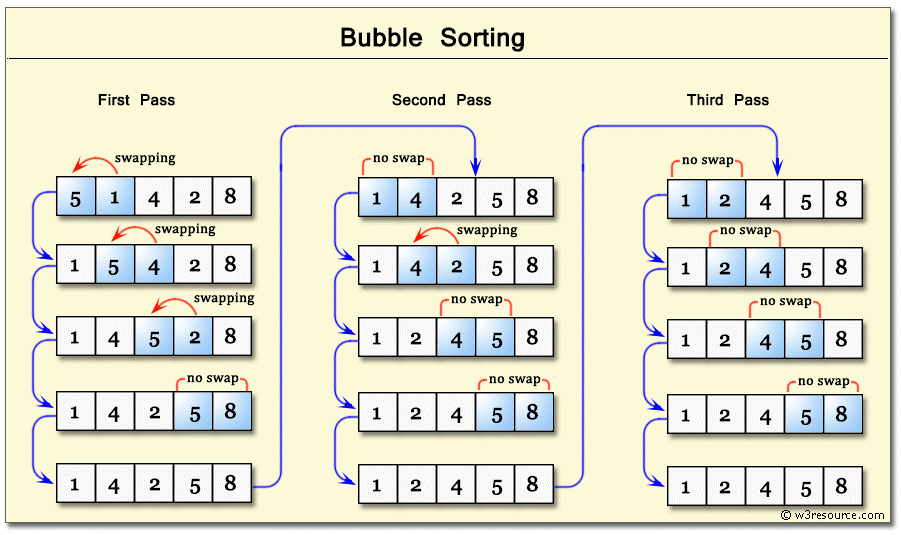
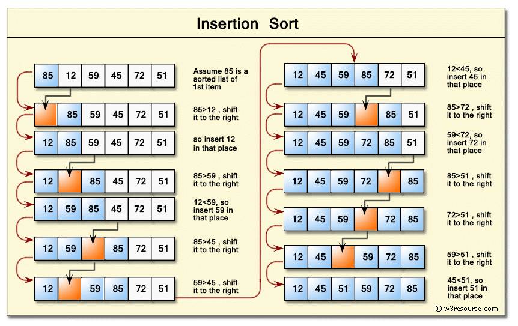

В эпоху больших данных необходимы современные алгоритмы, чтобы эффективно сортировать и быстро находить элементы в сложных структурах.

Выбор стратегии сортировки и поиска зависит от размера и типа данных.

Хотя конечный результат будет одинаковым для различных алгоритмов, для эффективного решения реальной проблемы нужно подобрать наиболее подходящий вариант. 

С пайтоном все отлично, взяли версию интерпретатора с python.org. 

Установили на винде, на маке, на линухе или убунте.
И во всех интепретаторах +- используется один и тот же алгоритм сортировки. 
Тиме Петерсона. 

Но с JS беда.
Беда, связанная с браузерами.
Интерпетатор то встроен в браузер. 

А браузеры конкурируют активно между собой не только интерфейсом и юзабилити, но и подкапотными движками, обрабатывающими код JS. 

Mozilla: SpiderMonkey, Rhino, Tamarin
Google: V8

В данной части представлены следующие алгоритмы сортировки:

* сортировка пузырьком (bubble sort); 
* сортировка вставками (insertion sort);
* сортировка слиянием (merge sort); 
* сортировка Шелла (Shell sort); z сортировка выбором (selection sort)


## Сортировка пузырьком

Известный, но никому ненужный – пузырьковый способ сортировки 



В нем хорошо показывать работу сортировки. А тем более в Pt есть мощный способ обмена значение переменных 
> a,b = b,a


В основе сортировки пузырьком лежит ряд итераций, называемых проходами (passes).

Для списка размера N нужно совершить N — 1 проходов. Рассмотрим подробно первую итерацию: проход 1.

Цель первого прохода — вывести наибольшее значение в конец списка. По мере выполнения алгоритма оно будет постепенно перемещаться вправо по списку.

В процессе сортировки значения соседних элементов сравниваются между собой попарно. 

Если в паре большее значение находится слева, происходит перестановка (обмен). Это продолжается до тех пор, пока мы не дойдем до конца списка. 


```python
def bubble_sort(lst):
    for cnt in range(len(lst) - 1, 0, -1):
        for i in range(cnt):
            if lst[i] > lst[i + 1]:
                lst[i], lst[i + 1] = lst[i + 1], lst[i]
    return lst


l = [5, 4, 3, 3, 2, 1, 4] # а лучше рандомно (0-99)
a = bubble_sort(l)
print(a)

```

Какова сложноcть алгоритма?


Но пузырьковая сортировки имеет свои преимущества. Если список уже отсорированный, мы можем дальше не ходить его сортировать.

Нужен некий флаг. И счетчик. 

Реализуем.

```python
def bubble_sort(lst):
    n = 0
    for cnt in range(len(lst) - 1, 0, -1):
        F = True
        n+=1
        for i in range(cnt):
            if lst[i] > lst[i + 1]:
                F = False
                lst[i], lst[i + 1] = lst[i + 1], lst[i]
        if F:
            print ('ok', n)
            break
    return lst


lst = [random.randint(0,100) for _ in range(10)]
lst = bubble_sort(lst)
print(lst)

```


Сортировка пузырьком (bubble sort) — это самый простой и медленный алгоритм сортировки. 

Он спроектирован так, что наибольшее значение перемещается вправо по списку на каждой итерации цикла.

При наихудшем сценарии производительность этого алгоритма равна `O(n2 )`, поэтому его следует использовать только для небольших наборов данных. Логика 




```python
В алгоритме происходит обмен со сдвигом

def insertion_sort(lst):
    for i in range(1, len(lst)):
        current = lst[i]
        pos = i
        while pos > 0 and lst[pos - 1] > current:
            lst[pos] = lst[pos - 1]
            pos = pos - 1
        lst[pos] = current
   
    return lst


```