## Алгоритмы поиска на графах 

* Поиск в ширину.
* Поиск в глубину.
* Поиск кратчайшего пути

* _Алгоритм Дейкстры_
* _Жадные алгоритмы_


Актуальность 


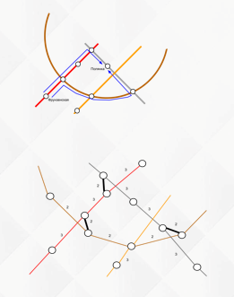


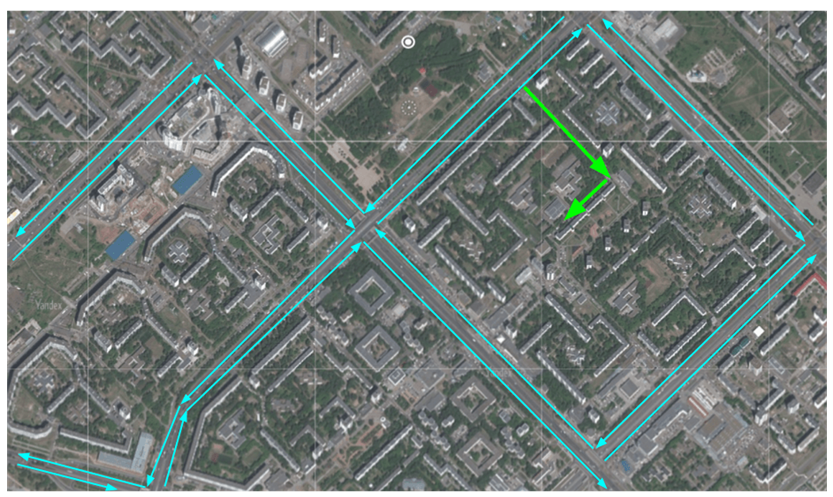


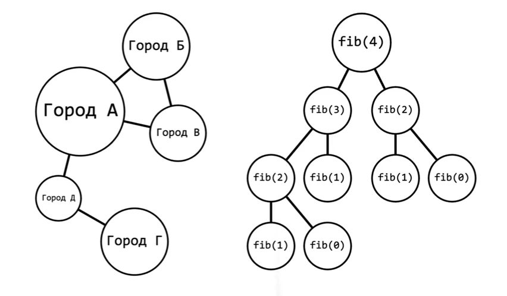

### Задача 
Сколько существует способов попасть из числа 3 в число 6, используя три команды, которым: 

* Прибавить 1, 
* Прибавить 2 или 
* Умножить на 2

Первая из них увеличивает число на экране на 1, вторая увеличивает его на 2, третья умножает его на 2. 

Построить граф траекторий вычислений


Сколько существует способов попасть из числа 3 в число 20, используя три команды, которым:

### Задача 

* Прибавить 1, 
* Прибавить 2 
* При этом траектория вычислений содержит число 9 и не содержит числа 15


## Что такое граф?


`Граф` – это конечное множество вершин (или узлов) и множество ребер, соединяющих эти вершины.
 


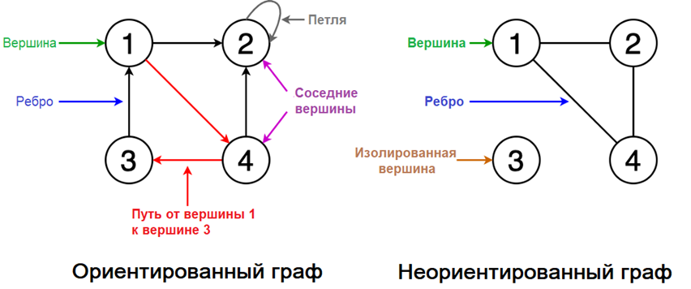

Две вершины называются `соседними`, если они соединены друг с другом ребром. 


`Путь` – последовательность вершин, в которой каждая вершина соединена со следующей вершиной ребром. 

На рисунке красными стрелками показан путь от 1 к 3 через 4.

* Порядок – количество вершин графа.
* Размер – количество ребер графа.
* Связность (степень связности) вершины – количество ребер, исходящих из этой вершины.
* Изолированная вершина – вершина, не связанная с другими вершинами графа.

* Петля – ребро от вершины к этой же вершине.
* Ориентированный граф – граф, в котором все ребра имеют направление, указывающее, какая из вершин ребра является начальной, а какая – конечной.
* Неориентированный граф – граф, в котором у ребер нет направлений.
* Взвешенный граф – все ребра графа имеют веса.
* Невзвешенный граф – ребра графа не имеют весов.

## Примеры ориентированных графов

#### Вертикальная структура управления 
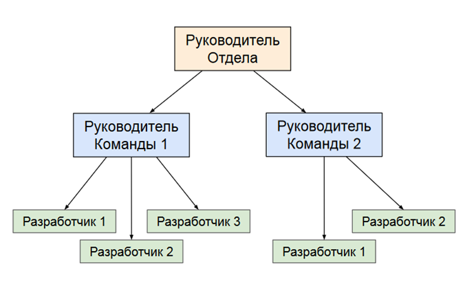

#### Последовательность фибоначи

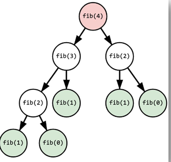


### Полный граф и сеть


## ? сколько ребер в графе с 4 вершинами

## сколько ребер в полном графе с 9 вершинами

> (n=p (p-1)/2, где р – количество вершин)

### Путь в графе

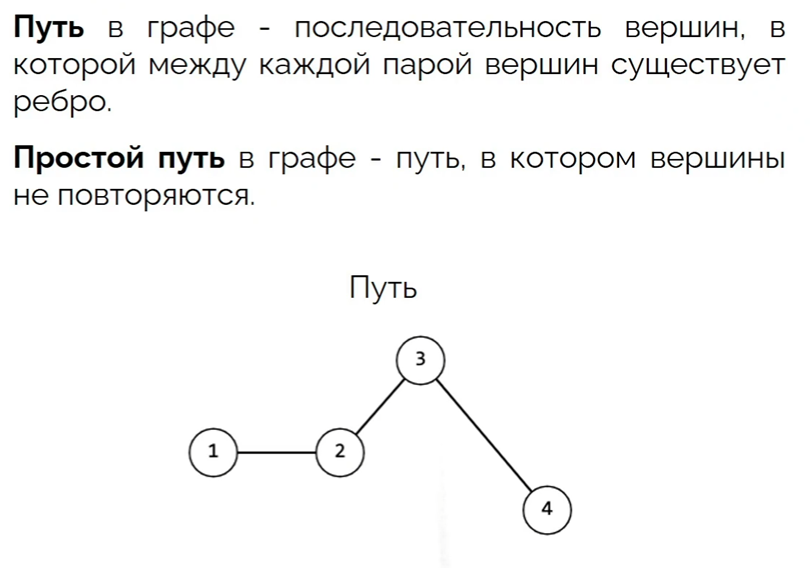

### Цикл в графе

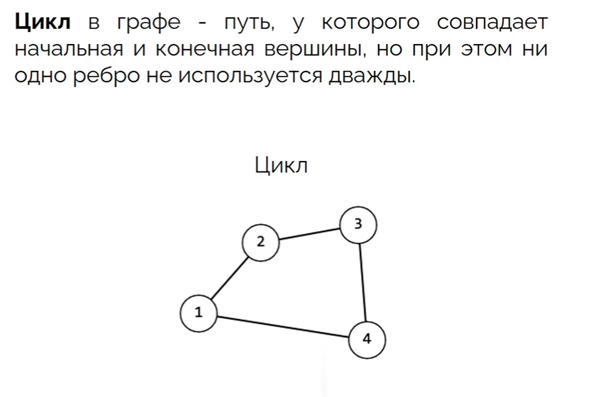


### Связный граф и компонента связности

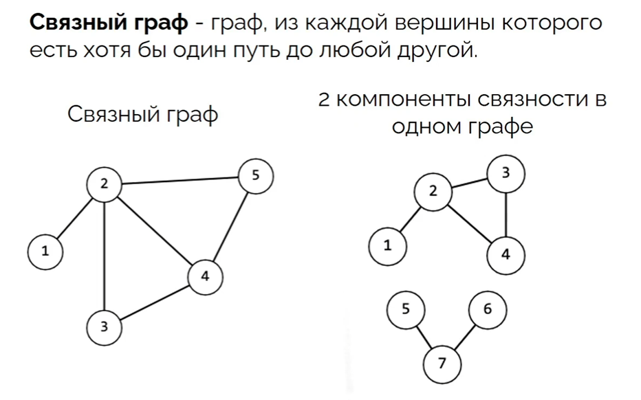


## Алгоритмы поиска на графах


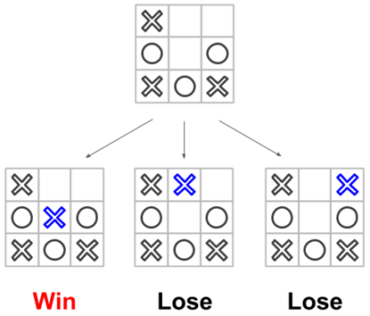

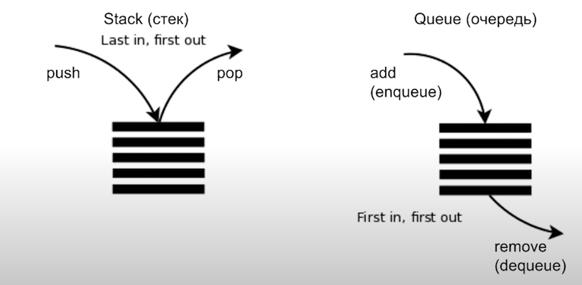

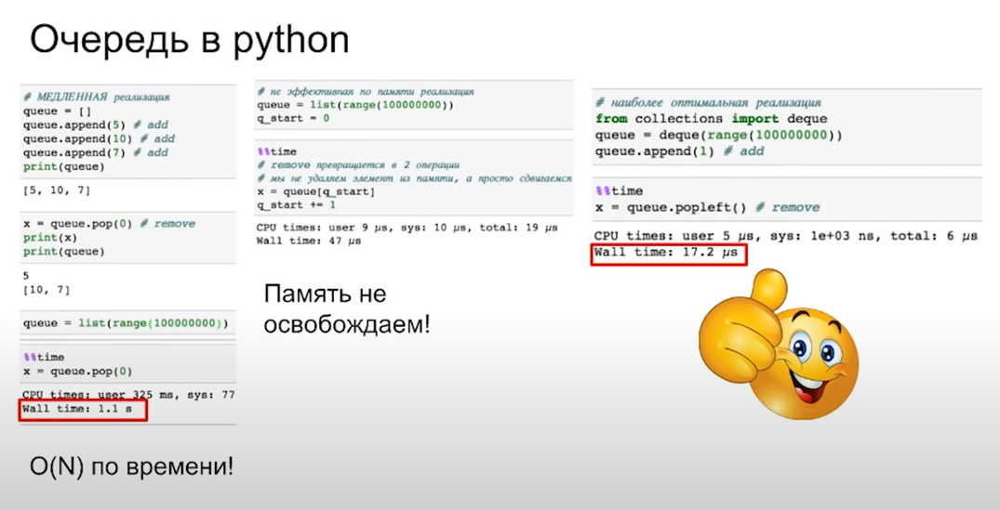

## Поиск в глубину (DFS)


Поиск в глубину используется:

* для нахождения пути между двумя вершинами;
* для обнаружения циклов в графе;
* для решения головоломок, имеющих только одно решение (например, лабиринтов).

### Таблица смежности


```python
graph = {
    1: {1, 2, 3, 4, 5},
    2: {1, 6, 7},
    3: {1, 8},
    4: {1},
    5: {1},
    6: {2},
    7: {2},
    8: {3},
}
```

Алгоритм

```python
def dfs(graph, start, visited=None):
    if visited is None:
        visited = set()
    visited.add(start)

    for next in graph[start] - visited:
        dfs(graph, next, visited)
    return visited
res = dfs(graph, 1)
```

Можно проще

```python
visited = set()
def dfs(v):
    # if v in visited:  
 #    return

    visited.add(v)  # Посетили вершину v
    for i in graph[v]:  # смежные с v вершины
        if not i in visited:
            dfs(i)

dfs(1) #начальная вершина обхода
print(visited)

```

### Задача. Нахождение пути сквозь лабиринт

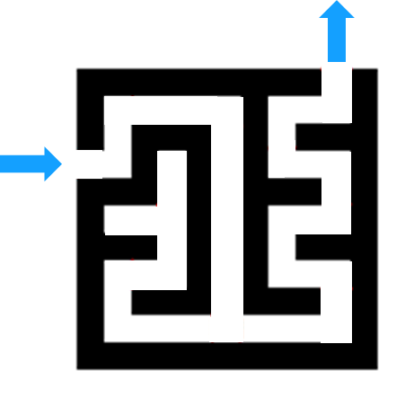

### Делим лабиринт на зоны

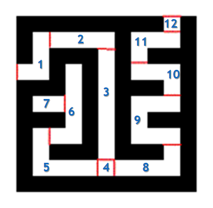

`Таблица смежности`


```python
graph = {
    1: {2},
    2: {1, 3},
    3: {2, 4},
    4: {3, 5, 8},
    5: {4, 6},
    6: {5, 7},
    7: {6},
    8: {4, 9},
    9: {8, 10},
    10: {9, 11},
    11: {10, 12},
    12: {11}
}
```

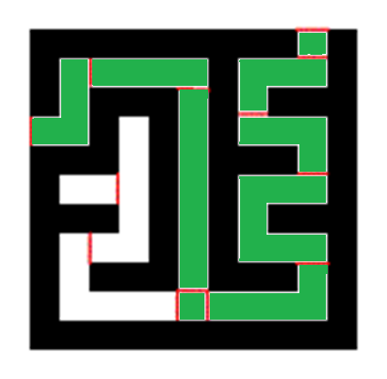


### Нахождение конкретного пути с помощью DFS?


## Поиск в ширину BFS (Breadth-First Search)

`Обход или поиск` – одна из основных операций, которую можно провести на графе. 

* При поиске в ширину мы начинаем с определенной вершины и исследуем всех ее соседей на том же уровне, прежде чем переходить к следующему уровню.

* В отличие от деревьев, графы могут содержать циклы (пути, в которых начальная и конечная вершины совпадают), так что нам придется отслеживать вершины, которые мы посетили. 

* Реализуя поиск в ширину, обычно используют структуру данных очередь.


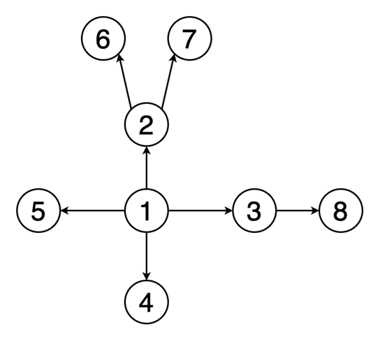

## Поиск в ширину используется:

* для обнаружения кратчайших путей и минимальных покрывающих деревьев;
* поисковыми системами для построения индексов веб-страниц;
* для поиска в социальных сетях;
* для нахождения доступных соседних узлов в одноранговых сетях вроде BitTorrent.


### Граф смежности

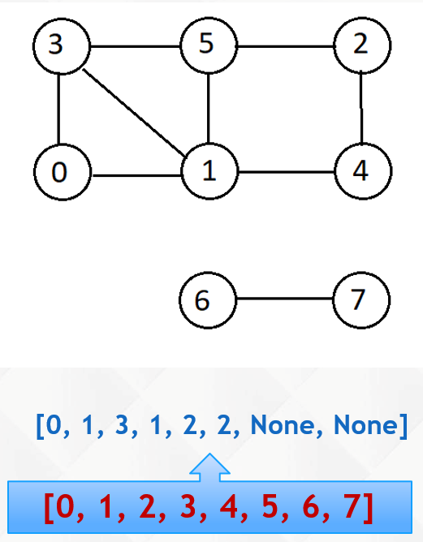

```python
graph = {
    0: {1, 3},
    1: {0, 3, 4, 5},
    2: {4, 5},
    3: {0, 1, 5},
    4: {1, 2},
    5: {1, 2, 3},
    6: {7},
    7: {6}
}
```

### Алгоритм BFS

```python
def bfs(graph, start, end):
    queue = [[start]]
    # queue.append()
    while queue:
        # формируем путь
        path = queue.pop(0)
        node = path[-1]
        if node == end:
            return path
        # перебираем соседние узлы, создаем
        # новый путь и помещаем его в очередь
        for vertex in graph[node]:
            new_path = path.copy()
            new_path.append(vertex)
            queue.append(new_path)

print(bfs(graph, 3, 4))

```

### Задача. Снова лабиринт


### Кратчайший путь


Кратчайший путь от одной вершины графа до другой – это путь, имеющий минимальный суммарный вес входящих в него ребер. 
На рисунке минимальный путь от вершины 1 к вершине 6

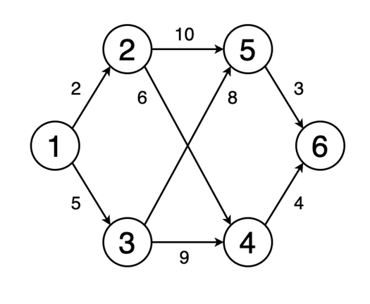

#### Алгоритм Дейкстры поиска минимального пути

Поиск кратчайшего пути используется:

* для построения маршрута в приложениях Яндекс-картах, 2-ГИС, Google Maps;
* при создании компьютерных сетей – чтобы обеспечить минимальную задержку;
* в абстрактных автоматах для определения оптимальной стратегии достижения некоторой цели через несколько промежуточных состояний (например, для подсчета, сколько нужно ходов для победы в игре).


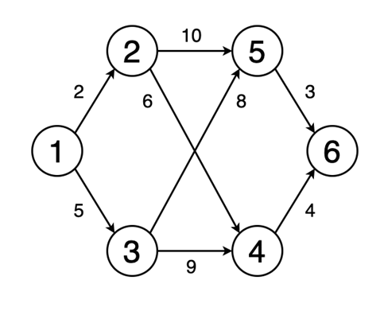

```python
nodes = ('1', '2', '3', '4', '5', '6')
distances = {
    '1': {'2': 2, '3': 5},
    '2': {'4': 6, '5': 10},
    '3': {'5': 8, '9': 4},
    '4': {'6': 4},
    '5': {'6': 3},
    '6': {},
}

unvisited = {node: None for node in nodes}
visited = {}
current = '1'
currentDistance = 0
unvisited[current] = currentDistance

while True:
    for vertex, distance in distances[current].items():
        if vertex not in unvisited: continue
        newDistance = currentDistance + distance
        if unvisited[vertex] is None or unvisited[vertex] > newDistance:
            unvisited[vertex] = newDistance
    visited[current] = currentDistance
    del unvisited[current]
    if not unvisited: break
    candidates = [node for node in unvisited.items() if node[1]]
    current, currentDistance = sorted(candidates, key=lambda x: x[1])[0]

print(visited)


```


