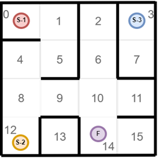
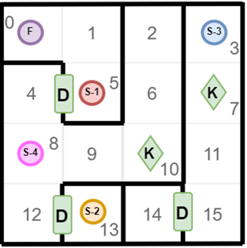
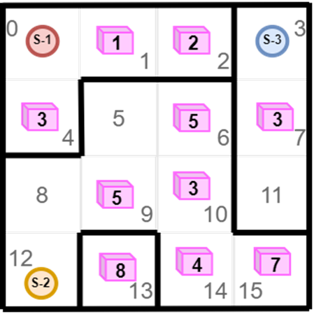

## Практические задачи


### Задача 1.

Определите: Из каких точек можно дойти до финиша(F), а из каких нет.




Выведите ответ в формате:

* Из точки S-1 можно дойти до финиша 
* Из точки S-3 нельзя дойти до финиша

```python
graph = {    

}

def dfs(v):
    visited[v] = v
    for w in graph[v]:
        if not visited[w]:
            dfs(w)
    return visited


checkpoint = {
    's-1': 0,
    's-2': 12,
    's-3': 3
}
final = 14

visited = [False] * len(graph)
# Реализация 
...
if ...
  print(f"Из точки {point} можно дойти до финиша")
else:
  print(f"Из точки {point} нельзя дойти до финиша")
...

```


### Задача 3.

Подумайте, как можно моделировать двери, используя существующие алгоритмы работы с графами.



Посетив клетку K, можно подобрать ключ, который отпирают любую дверь(D). 
Любым ключом можно открыть любое количество дверей
Выведите ответ в формате:

* Из точки S… можно добраться до финиша, используя ключ ... 
* Из точки S… можно добраться до финиша без ключа
* Из точки S… нельзя добраться до финиша


### Задача 4. Лабиринт с сокровищами



Розовые кубы - сокровища. 
Цифра на них - их ценность
Стартовав из каждой точки вы можете собрать только по два сокровища(больше не унести)
На какую суммарную ценность можно собрать сокровищ, стартовав из разных точек?
Выведите ответ в формате:
Из точки S-... можно собрать сокровищ суммарной ценностью ... 
Из точки S-... можно собрать сокровищ суммарной ценностью ...
