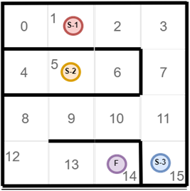

## Практические задачи

### Задача 1.

Определите: Из каких точек можно дойти до финиша(F), а из каких нет.

Выведите ответ в формате:

* Из точки S-1 можно дойти до финиша 
* Из точки S-3 нельзя дойти до финиша

### Задача 2.

Адаптируйте решение из предыдущего задания для новой конфигурации лабиринта

### Задача 3.

Подумайте, как можно моделировать двери, используя существующие алгоритмы работы с графами.

Посетив клетку K, можно подобрать ключ, который отпирают любую дверь(D). 
Любым ключом можно открыть любое количество дверей
Выведите ответ в формате:

* Из точки S… можно добраться до финиша, используя ключ ... 
* Из точки S… можно добраться до финиша без ключа
* Из точки S… нельзя добраться до финиша

### Задача 4. Лабиринт с сокровищами

Розовые кубы - сокровища. 
Цифра на них - их ценность
Стартовав из каждой точки вы можете собрать только по два сокровища(больше не унести)
На какую суммарную ценность можно собрать сокровищ, стартовав из разных точек?
Выведите ответ в формате:
Из точки S-... можно собрать сокровищ суммарной ценностью ... 
Из точки S-... можно собрать сокровищ суммарной ценностью ...
