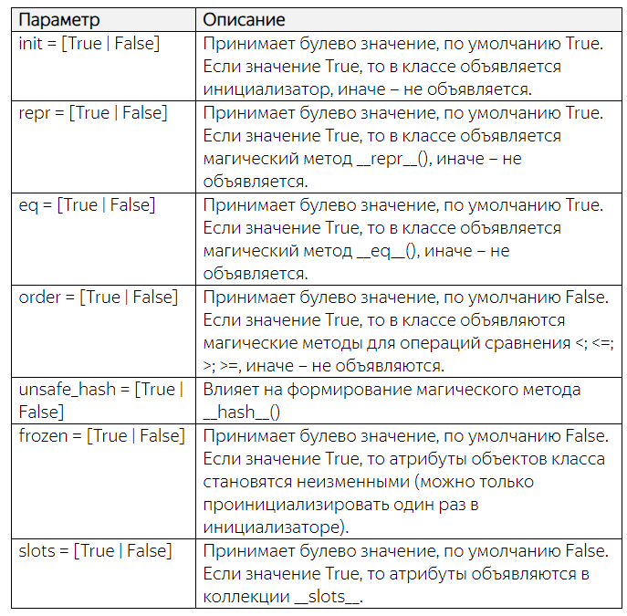

## Функция field

На предыдущиз занятиях мы в целом научились объявлять такие классы с помощью декоратора dataclass и определять набор необходимых атрибутов:

```python
@dataclass
class ThingData:
    name: str
    weight: int
    price: float = 0
    dims: list = field(default_factory=list)

```
Но давайте представим, что нам нужно в некотором классе, например, Vector3D при инициализации формировать вычисляемое свойство:
```python
class Vector3D:
    def __init__(self, x: int, y: int, z: int):
        self.x = x
        self.y = y
        self.z = z
        self.length = (x * x + y * y + z * z) ** 0.5
```
Здесь локальный атрибут length вычисляется на основе параметров x, y, z. Как это можно сделать при объявлении Data Classes?

### Метод `__post_init__()`
Вначале, очевидно, нужно прописать класс с тремя атрибутами следующим образом:

```python
@dataclass
class V3D:
    x: int
    y: int
    z: int
```
Что делать дальше, как определить локальный атрибут length внутри объекта класса V3D? Для этого существует следующая хитрость. 

Инициализаторы классов, сформированные с помощью декоратора dataclass, в конце своего вызова вызывают специальный метод `__post_init__()`. 

Именно в этом методе можно формировать любые вычисляемые свойства, например, так:

```python
@dataclass
class V3D:
    x: int
    y: int
    z: int
 
    def __post_init__(self):
        self.length = (self.x * self.x + self.y * self.y + self.z * self.z) ** 0.5
```

Если далее мы сформируем объект этого класса и выведем его в консоль:
```python
v = V3D(1, 2, 3)
print(v)
```
то увидим:

> V3D(x=1, y=2, z=3)

Спрашивается, почему здесь не видно свойства `length`? 

В действительности, оно присутствует в объекте v и мы в этом легко можем убедиться:

```python
print(v.__dict__)
```
увидим:

> {'x': 1, 'y': 2, 'z': 3, 'length': 3.7416573867739413}

Но тогда почему оно не выводится функцией `repr()`? 

Дело в том, что магический метод `__repr__()` выводит только те атрибуты, которые были указаны при объявлении класса. 

Все остальные, что создаются в процессе формирования объекта, не учитываются в методе __repr__(). 

Как тогда выйти из этой ситуации и указать, что локальный атрибут `length` также следует отображать? 

Очень просто! Давайте укажем этот атрибут при объявлении класса с небольшим уточнением:

```python
@dataclass
class V3D:
    x: int
    y: int
    z: int
    length: float = field(init=False)
 
    def __post_init__(self):
        self.length = (self.x * self.x + self.y * self.y + self.z * self.z) ** 0.5
```

Мы здесь воспользовались уже знакомой нам функцией `field()` и отметили, что атрибут `length` не следует использовать в качестве параметра инициализатора. 

Изящно, правда?! Теперь, при отображении объекта v класса, мы увидим и параметр `length`.

### Функция field()

Вообще функция `field()` предоставляет богатый функционал по управлению объявляемых атрибутов в `Data Classes`.

 Мы увидели, как работают два ее параметра: `init и default_factory`.
 
Довольно часто можно встретить использование еще трех:

* repr – булевое значение True/False указывает использовать ли атрибут в магическом методе __repr__() (по умолчанию True);
* compare – булевое значение True/False указывает использовать ли атрибут при сравнении объектов (по умолчанию True);
* default – значение по умолчанию (начальное значение).

Смысл их вполне понятен. Давайте исключим атрибут x из метода `__repr__()` и из операций сравнения атрибуты `z и length`. 

Получим следующее объявление класса:

```python
@dataclass
class V3D:
    x: int = field(repr=False)
    y: int
    z: int = field(compare=False)
    length: float = field(init=False, compare=False)
 
    def __post_init__(self):
        self.length = (self.x * self.x + self.y * self.y + self.z * self.z) ** 0.5
```
Тогда при отображении и сравнении двух объектов:
```python
v = V3D(1, 2, 3)
v2 = V3D(1, 2, 5)

print(v)
print(v == v2)
```
мы увидим только три атрибута: `y, z, length` и результат `True`, т.к. координаты `x, y` объектов `v и v2` совпадают.

С остальными параметрами функции `field()` можно познакомиться на странице официальной документации:

https://docs.python.org/3/library/dataclasses.html

### Объявление параметров типа InitVar

Давайте теперь предположим, что мы бы хотели вычислять длину вектора в зависимости от значения некоторого параметра, например, calc_len. При описании обычного инициализатора это можно было бы сделать следующим образом:

```python
class Vector3D:
    def __init__(self, x: int, y: int, z: int, calc_len: bool = True):
        self.x = x
        self.y = y
        self.z = z
        self.length = (x * x + y * y + z * z) ** 0.5 if calc_len else 0
```

А как это сделать при объявлении `Data Classes`? 

Для определения параметров, участвующих в инициализации (таких, как `calc_len`) в модуле `dataclasses` есть специальный класс типа `InitVar`:

```python
from dataclasses import dataclass, field, InitVar
```

Если при объявлении атрибут аннотируется этим классом, то он автоматически передается как параметр в метод __post_init__(), чтобы им можно было воспользоваться при формировании вычисляемых свойств:
```python
@dataclass
class V3D:
    x: int = field(repr=False)
    y: int
    z: int = field(compare=False)
    calc_len: InitVar[bool] = True
    length: float = field(init=False, compare=False, default=0)
 
    def __post_init__(self, calc_len: bool):
        if calc_len:
            self.length = (self.x * self.x + self.y * self.y + self.z * self.z) ** 0.5
```

Обратите внимание, я здесь для атрибута length добавил параметр `default=0 в функции field()`. 

То есть, начальное значение атрибута `length` равно нулю.

 Если параметр `calc_len` равен `True`, то в методе `__post_init__()` будет пересчитано и сформировано новое значение локального атрибута `length`.

### Параметры декоратора dataclass


До сих пор мы с вами использовали декоратор `dataclass` с параметрами по умолчанию. Однако ему можно передавать различные аргументы и управлять процессом формирования итогового класса. 
Вот основные параметры, которые принимает декоратор dataclass.


* init = [True | False] Принимает булево значение, по умолчанию True. Если значение True, то в классе объявляется инициализатор, иначе – не объявляется.

* repr = [True | False] Принимает булево значение, по умолчанию True. Если значение True, то в классе объявляется магический метод `__repr__()`, иначе – не объявляется.

* eq = [True | False] Принимает булево значение, по умолчанию True. Если значение True, то в классе объявляется магический метод `__eq__`(), иначе – не объявляется.

* order = [True | False] Принимает булево значение, по умолчанию False. Если значение True, то в классе объявляются магические методы для операций сравнения <; <=; >; >=, иначе – не объявляются.

* unsafe_hash = [True | False] Влияет на формирование магического метода `__hash__()`

* frozen = [True | False] принимает булево значение, по умолчанию `False`. Если значение True, то атрибуты объектов класса становятся неизменными (можно только проинициализировать один раз в инициализаторе).

* slots = [True | False] Принимает булево значение, по умолчанию `False`. Если значение `True`, то атрибуты объявляются в коллекции `__slots__`.




Существуют и другие параметры декоратора `dataclass`. 

Подробно о них можно почитать на странице официальной документации:

https://docs.python.org/3/library/dataclasses.html

Давайте последовательно рассмотрим основные из них. 

Первые параметры `init, repr, eq` я, думаю, понятны. Если в декоратор передать аргумент `init=False`:
```python
@dataclass(init=False)
```
то класс будет сформирован без собственного инициализатора (будет использован инициализатор базового класса). 

В результате у нас не получится создать объект с передачей значений аргументов:

```python
v = V3D(1, 2, 3, False)
```

Это бывает полезно, когда все описанные атрибуты принимают значения по умолчанию и не предполагается их сразу переопределять в инициализаторе. 

Например, если класс в дальнейшем будет использован как базовый для построения других дочерних классов.

Следующий параметр:
```python
@dataclass(repr=False)
```
запрещает формирование магического метода `__repr__()` внутри текущего класса. 

В результате, будет использован аналогичный метод базового класса. 

В этом легко убедиться, если создать объект и вывести его в консоль:

```python
v = V3D(1, 2, 3, False)
print(v)
```
Увидим что то похожее на:
```python
<__main__.V3D object at 0x00000236FAD67D50>
```
По аналогии работает параметр eq:
```python
@dataclass(repr=False, eq=False)
```
Он запрещает формирование собственного магического метода __eq__() для сравнения объектов между собой на равенство. 

Теперь объекты сравниваются по их идентификаторам, и так как они разные, то при сравнении:

```python
v = V3D(1, 2, 3, False)
v2 = V3D(1, 2, 3)
print(v == v2)
```
получаем значение `False`.

Следующий параметр order может быть установлен в True только совместно с eq=True. 

Например, следующая строчка приведет к ошибке:
```python
@dataclass(eq=False, order=True)
```
Поэтому нам нужно или убрать параметр `eq` (по умолчанию он `True`), либо явно прописать у него значение `True`:
```python
@dataclass(eq=True, order=True)
```
Я, думаю, вы догадались почему?
Операции сравнения на больше или равно, меньше или равно используют магический метод `__eq__()`.

Поэтому он должен присутствовать.

Итак, после включения параметра `order`, у нас появляется возможность сравнивать объекты класса на больше, меньше и больше или равно и меньше или равно:

```python
@dataclass(eq=True, order=True)
class V3D:
    x: int
    y: int
    z: int

 
v = V3D(1, 2, 5)
v2 = V3D(1, 2, 3)
 
print(v < v2)  # False
print(v > v2)  # True

```
Сравнение выполняется на уровне кортежей, содержащих значения атрибутов (x, y, z) в порядке их объявления в классе. 

В данном случае происходит последовательное сравнение сначала значений x между собой, затем, y и потом – z. 

Как только встречается пара, для которой можно вычислить значение True или False, проверка завершается. 

Фактически, в приведенном примере, сравниваются между собой только последние числа 5 и 3, остальные равны, поэтому операции < и > их пропускают.

Если нам нужно исключить какие-либо атрибуты из операций сравнений, то, как я уже отмечал, для этого следует использовать функцию field() и в ней через параметр compare исключить соответствующее поле:

```python
@dataclass(eq=True, order=True)
class V3D:
    x: int = field(compare=False)
    y: int
    z: int
```
Теперь сравниваться будут объекты только по двум локальным атрибутам y и z.

Здесь следует обратить внимание на то, что если в классе объявить какой-либо метод сравнения на больше, меньше или больше либо равно или меньше либо равно, то возникнет исключение TypeError:

```python
@dataclass(order=True)
class V3D:
    x: int = field(compare=False)
    y: int
    z: int
 
    def __lt__(self, other):
        return self.x < other.x and self.y < other.y
```

Последний параметр, который мы рассмотрим – `frozen`, позволяет «замораживать» значения атрибутов класса. 

Например:

```python
@dataclass(frozen=True)
class V3D:
    x: int
    y: int
    z: int
 
 
v = V3D(1, 2, 3)
print(v)
v.x = 5
```
Приведет к ошибке в последней строчке, т.к. менять локальные атрибуты при `frozen=True` в объектах класса нельзя.