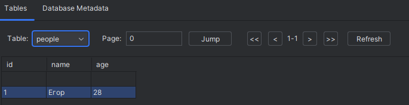
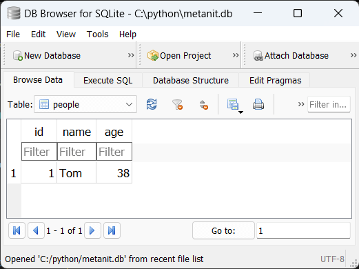

## Создание сессии базы данных

Для взаимодействия с базой данных необходимо создать сессию базы данных, которая представляет объект `sqlalchemy.orm.Session`. 

Через этот объект идет вся работа с БД.

Но для этого вначале надо создать класс-построитель Session с помощью функции-фабрики `sessionmaker()`


```python
Session = sessionmaker(autoflush=False, bind=engine)
```

эта функция принимает ряд параметров, в частности, здесь применяется два параметра

* autoflush: при значении `True` (значение по умолчанию) будет автоматически вызываться метод `Session.flush()`, который записывает все изменения в базу данных

* bind: привязывает сессию бд к определенному движку, который применяется для установки подключения

Результатом функции является класс `Session`. 
После этого можно создать объект этого класса и через него взаимодействовать в бд:

```python
Session = sessionmaker(autoflush=False, bind=engine)
# создаем саму сессию базы данных
with Session(autoflush=False, bind=engine) as session:
    pass
```

Здесь db как раз представляет объект `Session`.

В качестве альтернативы можно использовать встроенный класс `Session`:

# CRUD

## Добавление данных (CRUD - CREATE)

Для добавления в базу данных необходимо сначала создать объект модели, который передается в метод `add()` объекта `Session`. 

После добавления для подтверждения изменений у объекта `Session` вызывается метод `commit()`.

Например, определим файле приложения следующий код:

```python

with Session(autoflush=False, bind=engine) as db:
    user = Person(name="Егор", age=28)
    db.add(tom)  # добавляем в бд
    db.commit()  # сохраняем изменения
    print(user.id)  # можно получить установленный id
```


В данном случае создается объект Person, который добавляется в бд. Если после этого мы откроем бд, то сможем увидеть добавленный объект:



Стоит отметить, что в данным случае в классе Person атрибут id выступает в качестве первичного ключа и генерируется в самой бд при добавлении строки в таблицу. 

Но после добавления объекта мы можем получить значение данного атрибута:

>  print(user.id)  

Следует отметить, что после добавления или обновления объекта, если мы хотим использовать этот объект, обращаться к его атрибутами, то желательно, а иногда может быть необходимо, использовать метод `refresh()`, который обновляет состояние объекта:

```python


```




Подобным образом можно добавить несколько объектов:

```python
with Session(autoflush=False, bind=engine) as db:
    user1 = Person(name="Сергей", age=28)
    user2 = Person(name="Владимир", age=32)
    db.add(user1)
    db.add(user2)
    db.commit()

```

Причем метод `commit()` вызывается только один раз.

Однако есть надо добавить несколько объектов, то проще применить метод `add_all()`, который добавляет список объектов:

```python
with Session(autoflush=False, bind=engine) as db:
    user1 = Person(name="Сергей", age=28)
    user2 = Person(name="Владимир", age=32)
    db.add_all([user1, user2])
    db.commit()
```
## Получение данных (CRUD - READ)

Для получения объектов из базы данных вначале у объекта Session необходимо вызывать метод `query()` - в него передается тип модели, данные которой необходимо получить:

```python
db.query(Person)
```

Но данный метод просто создает объект `Query` - некоторый запрос, который будет выполнен в будущем при непосредственном получении данных.

Далее применяя к объекту Query различные методы, мы можем получить непосредственный результат.

Например, если надо получить все объекты, применяется метод `all()`:

```python
people = db.query(Person).all()
```

Метод `all` возращает список объектов модели. 

```python
with Session(autoflush=False, bind=engine) as db:
    people = db.query(Person).all()
    for p in people:
        print(f"{p.id}.{p.name} ({p.age})")
```

В результате программа получит объекты Person и выведет из данные на консоль:

```
1.Егор (28)
2.Владимир (32)
3.Сергей (28)
4.Владимир (32)
```

Для получения одного объекта по `id` применяется метод `get()` класса `Session`. 

В качестве параметров метод получает тип модели и идентификатор объекта, который надо получить. 

Например, получим один объект `Person`, у которого `id = 1`:

```python

first_person = db.get(Person, 1)
print(f"{first_person.name} - {first_person.age}")  


```